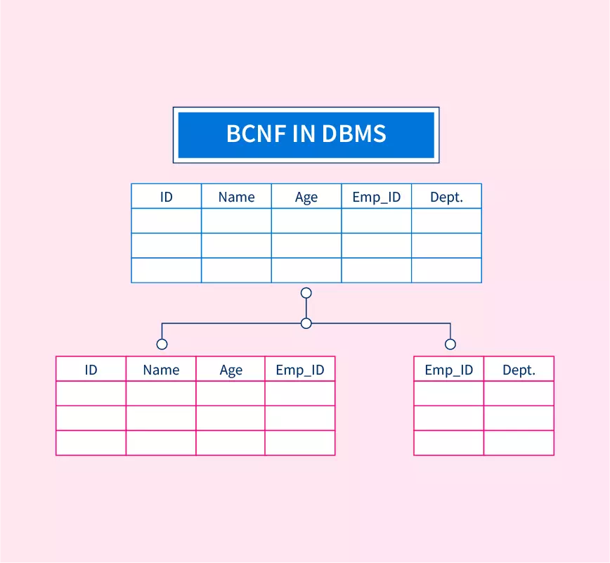

### Topic : Normal Forms
---
During flipped class I learned about **First normal form and second normal form**,**BCNF**(Boyce-Codd Normal Form),**Third Normal Form**.
Normalization is the process of minimizing the redundancy from the relation. Moreover Normal forms are mainly used to eliminate or reduce the redundancy in the database.

**First normal form** contains only a single value and each column have a unique name. It helps to eliminate duplicate data and simplify queries. The diagram below is the example of 1NF. Table A is not 1NF because it has multi-valued attribiute in the course. Table A is converted to 1NF and it does't have multi-valued.

**Second normal form** helps to eliminate redundant data by requiring that each non-key attribute is dependent on the primary key. Each column in 2NF should be directly related to the primary key, and not to other columns. Moreover the relational in second normal form is 1NF.

**Third normal form** has column that is directly related to the primary key of the database and it is build upon the 2NF. In third normal form the relation is in 2NF and it doesn't contian any transitive partial dependency. 3NF is used to reduce the data duplication and used to achieve the data integrity. On top of that a relaton is in third normal form if it holds atleast on of the followig two conditions, X is a super key and Y is a prime attribute, i.e each element of Y is part of some candidate key.

**Boyce-Codd Normal Form** is the adance version of 3NF amd often it is known as the 3.5 normal form. BCNF is based on functional dependencies and all the candidate key of the relation are taken into consideration. So a table or relation is said to be in BCNF if it satisfies the following two conditions that is, it should satisfy all the conditions of the third normal form, for any functional dependency(A->B), A should be either the super key or the candidate key. 

During flipp class we discuss about **Fourth normal form**. 4NF is a database management systems to reduce data redundancy and improve data integrity. It is build on the concepts of earlier normal forms(1NF,2NF,3NF). The advantage of 4NF is the elimination of data redundancy. By breaking down relations into smaller, more focused ones. On top of that it also has the advantage of increased maintainability. So the 4NF is an essential concept id database design and normalization. By addressing multi-valued dependencies and decomposing relations into smaller, more focused ones, it ensures data consistency, minimizing redundancy and improves database performance.

