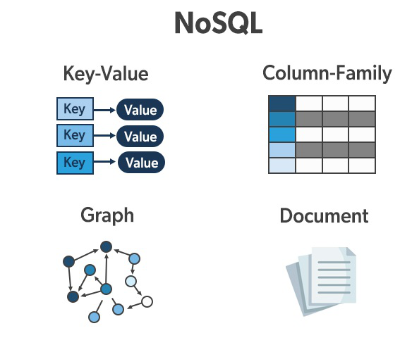
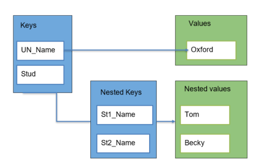
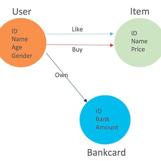
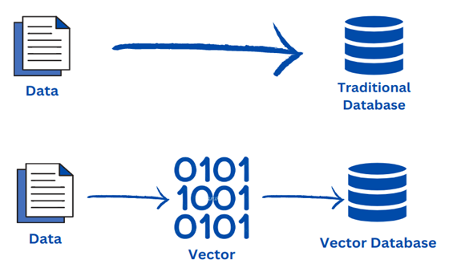
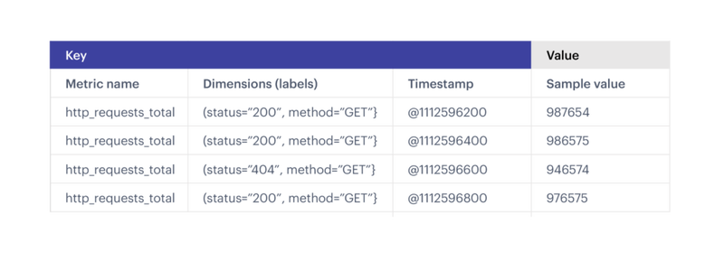
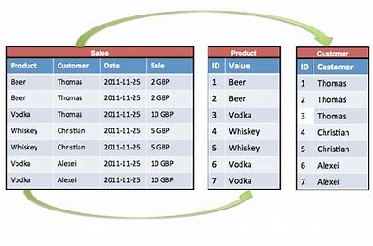
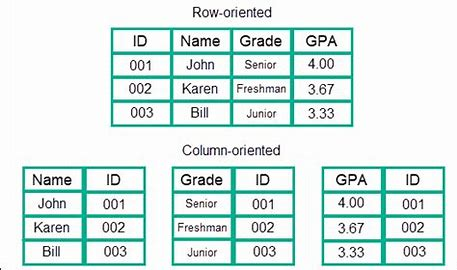

### Topic : Advantages, Disadvantages and applications of types of Nonrealtional Databases.
---
During flipped class I learned about types of NoSQL databases **Document based batabases**,**Key-value based database**,**Graph databases**,**Vector databases** and **Time-series database**. A database is a collection of structured data and information that is stored in a computer system and can be accessed easily and managed by database management system. So NoSQL database is a non-realtion database that is used to store the data in a nontabular form. 

**Document-based database** is nonrelational database that uses the documents to store the data in the database instead of storing the data in rows and column. The documents it uses are in JSON, BSON and XML documents.

.png>)

Some of the key features of documents database are **flexible schema** the documents in the database need not be the same schema. **Faster creation and maintenance** the creation of documents is easy.

**Key-value stores** the data element in the database is store in key-value pairs. The data can be retrieved by using a unique key allotted to each element in the database and it also commonly known as a dictionary or hash table. 

Some of the key features of the key-value store are **simplicity**,**scalability** and **speed**.

**Graph-based database** stores the data in the from of nodes on the database. It uses nodes, edges, and properties instead of tables or documents to represent and store data. So the edges represent relationships between the nodes.

In a graph base database, it is easy to identify the relationship between the data by using the links. The output query is real time results. Updating data is also easy as adding a new node or edge to a graph database is a stright forward task.

**Vector databases** stores data as mathematical representation and data can be identify based on similarity metrics instead of exact matches, making it possible for a computer model to understand data contextually.

**Time-series database** data are store as associated pairs of time and value. It is also designed to store and retrieve data for each point in time. Time series database are used when application needs data that accumulates quickly. it is even used in financial or industrial applications and so and so forth.

During flipped class I discuss about the **column oriented database**. It stores data table by column rather than by row. It is helpful in data analytics and data warehousing. also the major motive of Columnar Database is to effectively read and write data. Some of the benefits of column oriented database are it is efficient to access the data and it has more options for data compression but less efficient for the inserting new data.

