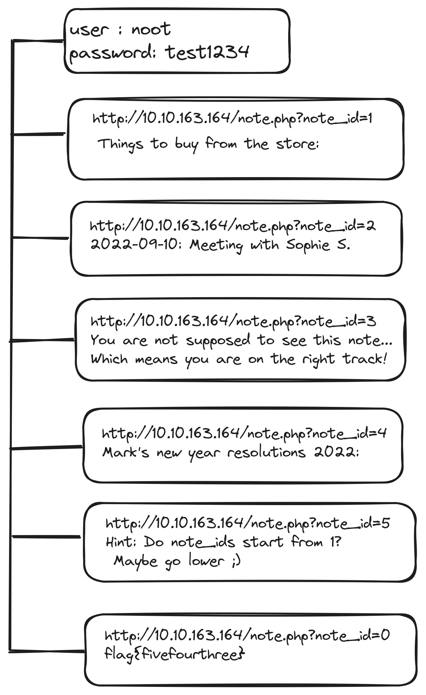
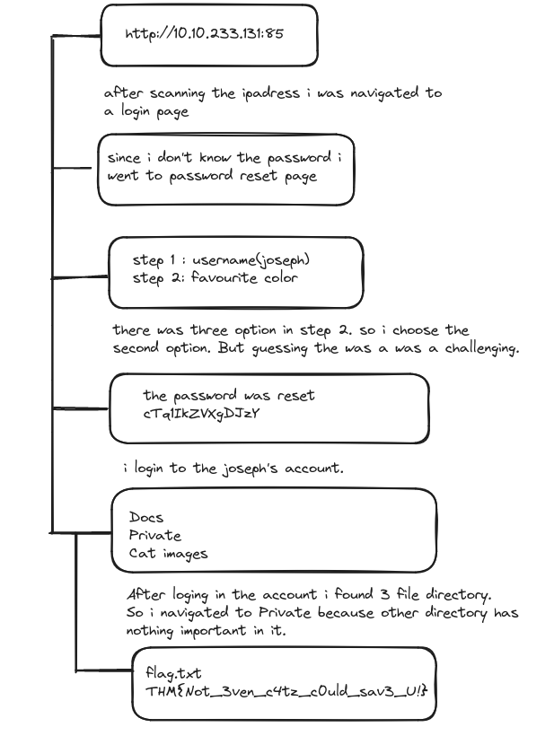
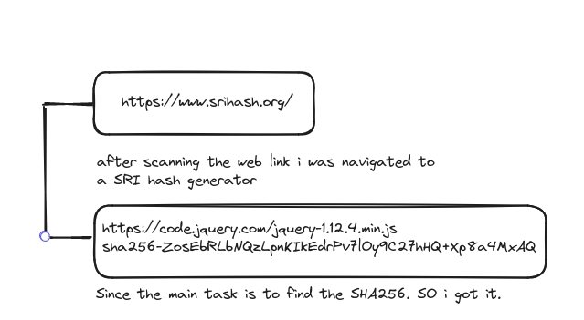

# Topics : OWASP Top 10-2021
---
## Insecure direct object reference(IDOR)
IDOR is basically gaining the access control vulnerability where we can gain access the resource of any organization that we are not meant to access. This can happen when a programmer manipulate identifiers used in a web application's URLs or parameters.

Now in this web page to do direct object reference. I changed the identifier  till 5 and there was some hind showing.

Cryptographic failure is the type of vulnerability arising from the misuse of the cryptographic algorithms for protecting sensitive information. In cryptographic failure man in the middle try to access the data by divulging sensitive data from their device. So it is often known as “Man in the middle attacks”.  When the data is encrypted the network traffic between the client and the server undergo two process Encrypting data in transit(initial stage) and encrypting data at rest(final stage).

When data is store in database it follow the SQL syntax and even the data can be stored as flat-files. But the flat files are store in the disk of computer unlike the SQL it is store in database.

**Usage of Crack station.**
When we try to log in to the web, the password and the user name is store in the backend  database. Every details are stored as plain text except for the password. It is stored as encrypted form of password 128-bit binary by passing through the hashing algorithm. So to gain access the hackers need to reverse the hash algorithm but it is impossible. But with the help to rainbow tables it is easy to crack the password if the commonly used password is in the rainbow table. If the password is not a commonly used password there are two ways namely dictionary attack and brute force attack. However there is a new technique called Salting is introduce where specific combination of characters are sprinkled at specific parts of the plain text password before hashing. When using the salting technique even though if the password is commonly used password, it doesn’t match the password which is not salted. Here the scenario is adding spices to the curry. So the brute force attack and word list attack doesn’t work here.

**Cryptographic Failures (Challenge)**

**Injection**
Two types of Injection;

1/ SQL injection : manipulating the user input and accessing the sensitive information.

2/ Command injection : executing the arbitrary system commands on the application servers and accessing the user system.

So to prevent the injection attacks, there are two methods

1/ using an allow list : when input is send to server if the input is marked safe it is processed, else it is rejected and the application throws an error.

2/ Stripping input : When input is send to server  if the input contains a dangerous character, then the input is removed before processing.

**Challenge**

**Insecure Design**
Insecure design vulnerabilities occurs when it lacks the input validation controls, sensitive information disclosure, and missing secure communication layers.

**Security Misconfiguration**

**Vulnerable and outdated components**
If the Linux Kernel version is less than 4.6 is vulnerable to an unauthenticated remote  code execution exploit. But i found my kernel version 6.6.9.

**Vulnerable and Outdated components- Lab**

**Identification and authentication failures.**
User gain access to the web application by verifying themself using the username and password mechanism. So user sends the identities to the server and verify the user.  After verification the server will send the session cookies to communicate and to know who is send the data and to keep the track of user’s actions.

But the weak point here is if the attacker is able to the flaws in the authentication they might be successfully gain access in the user account and access sensitive data. So below given is the common flaws in the authentication mechanisms:

- Brute force attack : try to attempt with every possible username and password.
- Use of weak credentials : using of weak password or common password, so the attackers will easily guess the password.
- Weak session cookies : session cookies keeps track of the user action. but if the session cookies has the predictable values, then the attacker will create their won and gain the access to the user account.

**To prevent the above flaws;**
- The web application should enforce strong password.
- The web application should enforce automatic lockout after certain number attempts to avoid brute force attack.
- Implementing multi-factor authentication.

**Identification and authentication failures Practical**

**Software and Data Integrity Failures**
It happens when the code implementation and the underlying infrastructure lack the ability to protect the code against all integrity violations. So when we download any file a hash is send along side the file to make sure that the file is kept its integrity and wasn’t modified in transit. There are many types of hash including MD5, SHA1, SHA256 and many. 

**Data Integrity failures**
When ever user tries to login to the web, to save the login sessions they assign us with some sort of session token. This session token is can come in many forms but usually assigned via cookies. This cookies are key-value pairs where web application will store the user browser and save every activity of the user. Now to guarantee that if the cookies are not modified by the user. we can implement JSON Web Tokens(JWT). 

The header contains metadata indicate it is a JWT and the signing algorithm use is HS256. The payload contains the key-value pairs with the data that the web application wants the client to store. The Signature is similar to a hash , taken to verify the payload’s integrity. 

**Security Logging and Monitoring Failures.**
when we set up the web application it’s important to login because to trace the attacker’s activities. And once their actions are traced, their risk and impact can be determined. The impacts are Regulatory damage and Risk of further attacks. 

The information stored in the logs include HTTP status code, Time Stamps, Username, API endpoints/page location and IP addresses.

The IP address used by the attacker is 49.99.13.16 and the attacker is using Brute Force attack.

Server-Side Request Forgery(SSRF)

In a Server-Side Request Forgery (SSRF) attack, the attacker can abuse functionality on the server to read or update internal resources. The attacker can supply or modify a URL which the code running on the server will read or submit data to, and by carefully selecting the URLs, the attacker may be able to read server configuration such as AWS metadata, connect to internal services like http enabled databases or perform post requests towards internal services which are not intended to be exposed.

