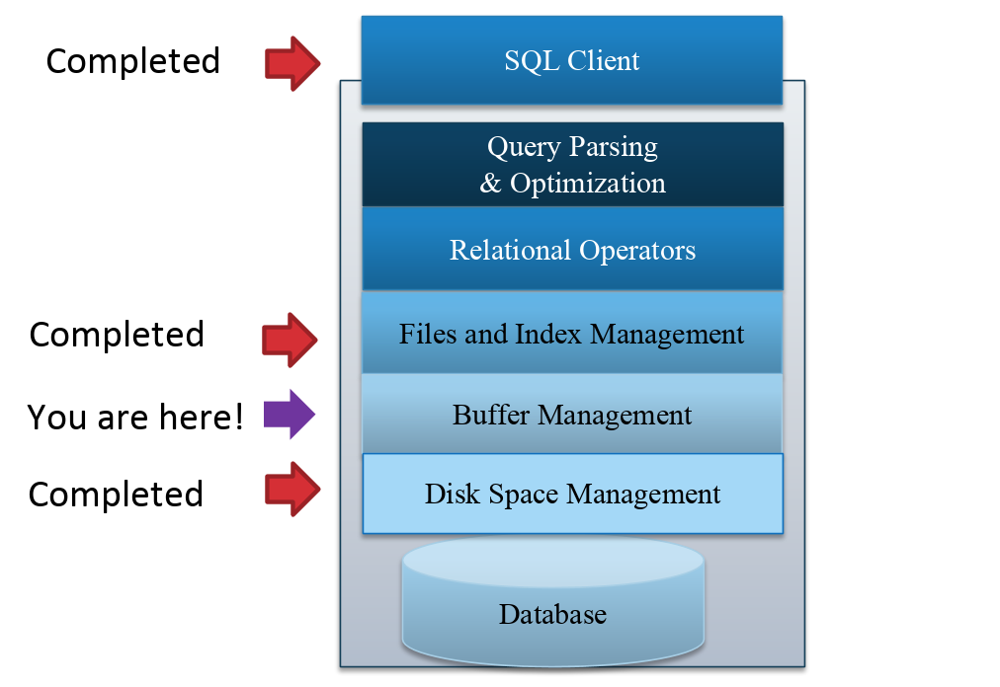
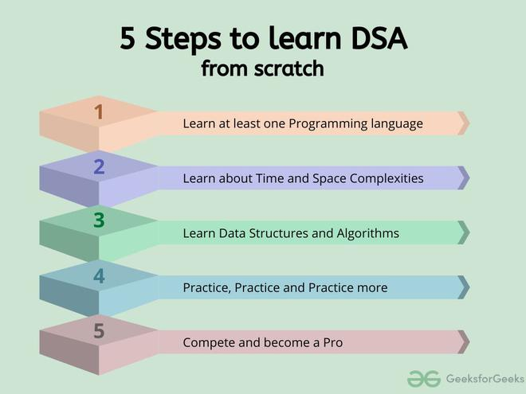

### Topic : Task on storage and buffer management
---
Storage and buffer management is the underlying system software and manages retrieval and transmission of the data to and from the user and the supported storage mediums, including RAM and whatever non-volatile memory is supported by the database.

The task in the guided session is design to demonstrate the simple disk block allocation system. It showed how data i sdivided into blocks, allocated on thedisk, and retrieved while handling fragmentation. ARAID system was simulated,showcasing two levels(RAID0andRAID1)and their functionalities.This highlighted the concept of using multiple physical disks for improved performance and redundancy in data storage.A Buffer Pool was implemented,simulating a cache for data access optimization. It  demonstrated how frequently used data is kept in memory for faster retrieval while managing limited memory space using an LRU(LeastRecentlyUsed) strategy.

The exercise is about building a relational database from scracth. It includes five steps  which are as follows:
1/ Learning atleast one programming language. 2/Learn about Time and Space complexities. 3/Learn the basics of individual Data Structures and Algorithms. 4/Practice, Practice, and Practice more and 5/Compete and Become a Pro. 

When learning about time and space complexity it is very important to know about the Big O notation graph.

