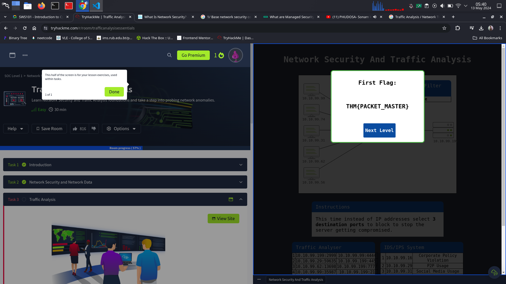
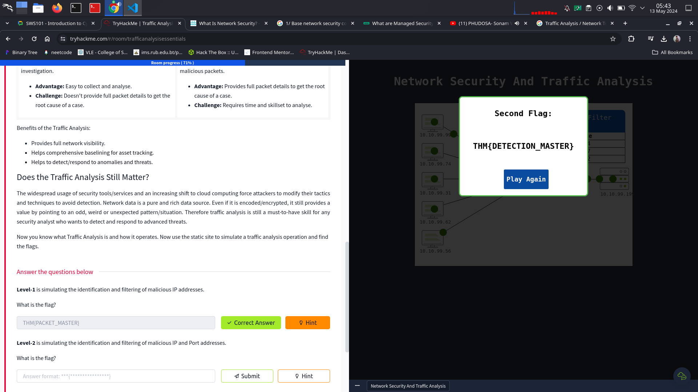
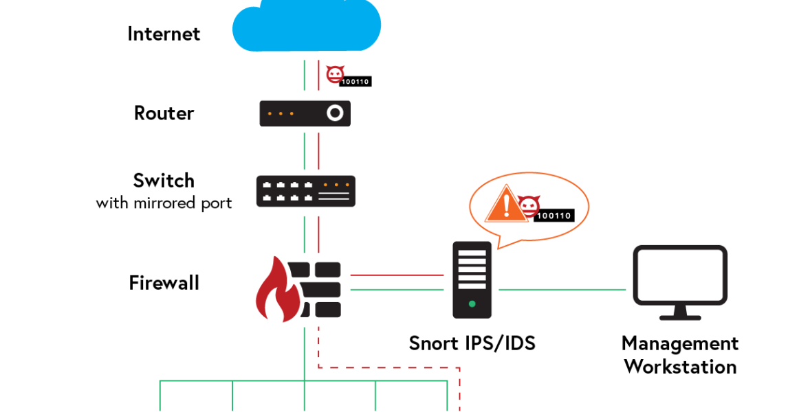
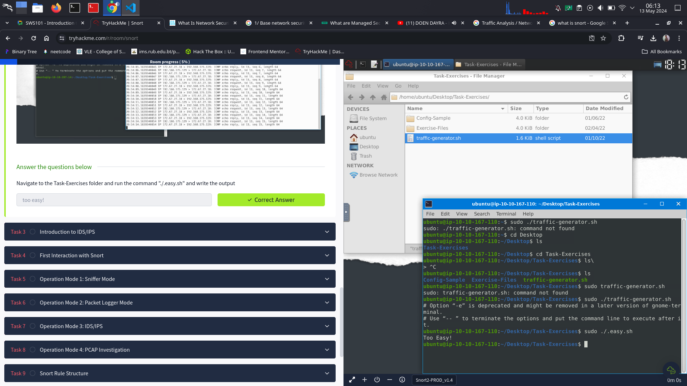

## Network security

Network security is the protection of the underlying network infrastructure from  the uautheorized access, misuse, or the theft. It involves creating a secure infrastructure for devices, application, users and applications to work in a secure manner. Under network security there is a traffic analysis that focus on investigating the network data to identify problems and anomalies.

The network security focuses on two things, authentication and authorisation and contians three base control levels to ensure the maximun available security management. 1/ Base network security control levels,
2/ The key elements of access control,
3/ The key elements of threat control.

To manage the network security the companies use the Managed security services(MSS) for devices and entire network both on public and private. THe services are operated by third party providers, typically on a consumption based model and include security such as firewalls and real time intrusion detction and analysis.

The important of managing the network security is to provide cybersecurity and protection on digital assets and infrastructure.

1) Which Security Control Level covers contain creating security policies?
=> Administrative
2) Which Access Control element works with data metrics to manage data flow?
=> Load Balancing
3) Which technology helps correlate different tool outputs and data sources?
=> SOAR(security orchestration automation and response)

## Traffic Analysis/ Network Traffic Analysis

Network traffic analysis (NTA) is a method of monitoring network availability and activity to identify anomalies, including security and operational issues.

**Benefits of the Traffic Analysis:**

Provides full network visibility.

Helps comprehensive baselining for asset tracking.

Helps to detect/respond to anomalies and threats.

**Level-1 is simulating the identification and filtering of malicious IP addresses.**

**What is the flag?**

**Level-2 is simulating the identification and filtering of malicious IP and Port addresses.**

**What is the flag?**

## Snort

Snort is the foremost Open Source Intrusion Prevention System (IPS) in the world. Snort IPS uses a series of rules that help define malicious network activity and uses those rules to find packets that match against them and generates alerts for users. SNORT can be used to monitor the traffic that goes in and out of a network. It will monitor traffic in real time and issue alerts to users when it discovers potentially malicious packets or threats on Internet Protocol (IP) networks.

**Snort has three main use models:**

Sniffer Mode — Read IP packets and prompt them in the console application.

Packet Logger Mode — Log all IP packets (inbound and outbound) that visit the network.

NIDS (Network Intrusion Detection System) and NIPS (Network Intrusion Prevention System) Modes — Log/drop the packets that are deemed as malicious according to the user-defined rules.

**Task2**

**Task 3**

**Intrusion Detection System (IDS)**

IDS is a passive monitoring solution for detecting possible malicious activities/patterns, abnormal incidents, and policy violations. It is responsible for generating alerts for each suspicious event.

**There are two main types of IDS systems;**

Network Intrusion Detection System (NIDS) — NIDS monitors the traffic flow from various areas of the network. The aim is to investigate the traffic on the entire subnet. If a signature is identified, an alert is created.

Host-based Intrusion Detection System (HIDS) — HIDS monitors the traffic flow from a single endpoint device. The aim is to investigate the traffic on a particular device. If a signature is identified, an alert is created.

**Intrusion Prevention System (IPS)**

IPS is an active protecting solution for preventing possible malicious activities/patterns, abnormal incidents, and policy violations. It is responsible for stopping/preventing/terminating the suspicious event as soon as the detection is performed.

**There are four main types of IPS systems;**

1) Network Intrusion Prevention System (NIPS) — NIPS monitors the traffic flow from various areas of the network. The aim is to protect the traffic on the entire subnet. If a signature is identified, the connection is terminated.

2) Behaviour-based Intrusion Prevention System (Network Behaviour Analysis — NBA) — Behaviour-based systems monitor the traffic flow from various areas of the network. The aim is to protect the traffic on the entire subnet. If a signature is identified, the connection is terminated.

3) Wireless Intrusion Prevention System (WIPS) — WIPS monitors the traffic flow from of wireless network. The aim is to protect the wireless traffic and stop possible attacks launched from there. If a signature is identified, the connection is terminated.

4) Host-based Intrusion Prevention System (HIPS) — HIPS actively protects the traffic flow from a single endpoint device. The aim is to investigate the traffic on a particular device. If a signature is identified, the connection is terminated.

**Which snort mode can help you stop the threats on a local machine? => HIPS(Host-based Intrusion Prevention System )**

**Which snort mode can help you detect threats on a local network? => NIDS(Network Intrusion Detection System)**

**Which snort mode can help you detect the threats on a local machine? => HIDS(Host-based Intrusion Detection System)**

**Which snort mode can help you stop the threats on a local network? => NIPS(Network Intrusion Prevention Syaytem)**

**Which snort mode works similar to NIPS mode? => NBA(Network Behaviour Analysis)**

**According to the official description of the snort, what kind of NIPS is it? => Full-blown**

**NBA training period is also known as ... => baselining**

**Task 4**

**Run the Snort instance and check the build number. => 149**

**Test the current instance with "/etc/snort/snort.conf" file and check how many rules are loaded with the current build. => 4151**

**Test the current instance with "/etc/snort/snortv2.conf" file and check how many rules are loaded with the current build. => 1**

