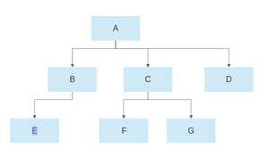
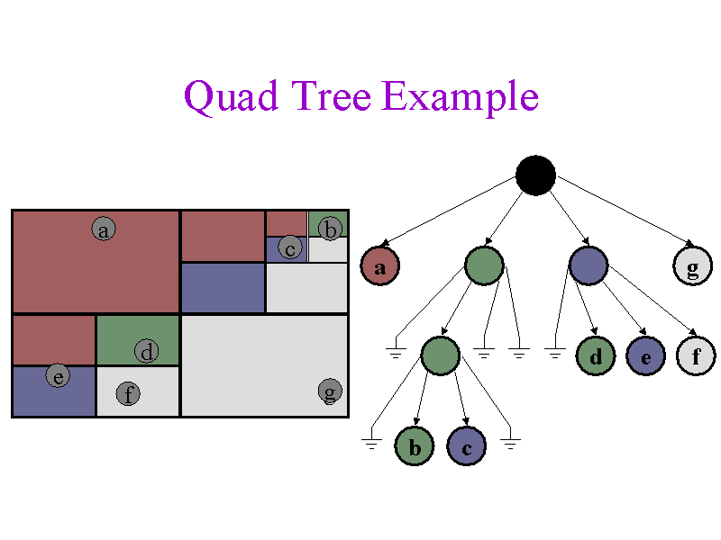
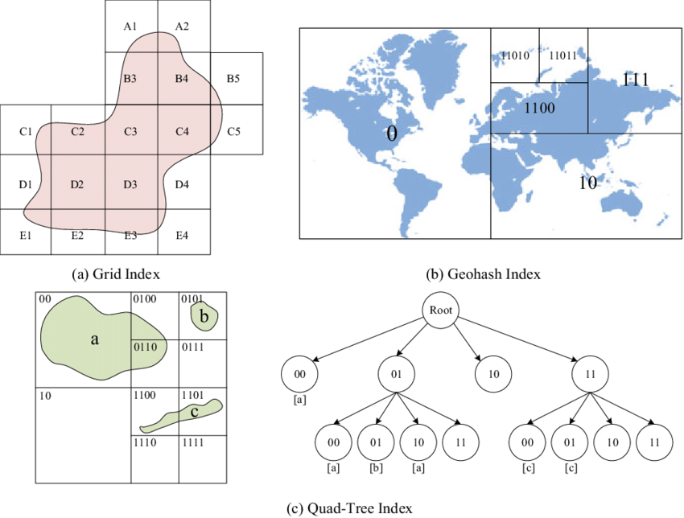
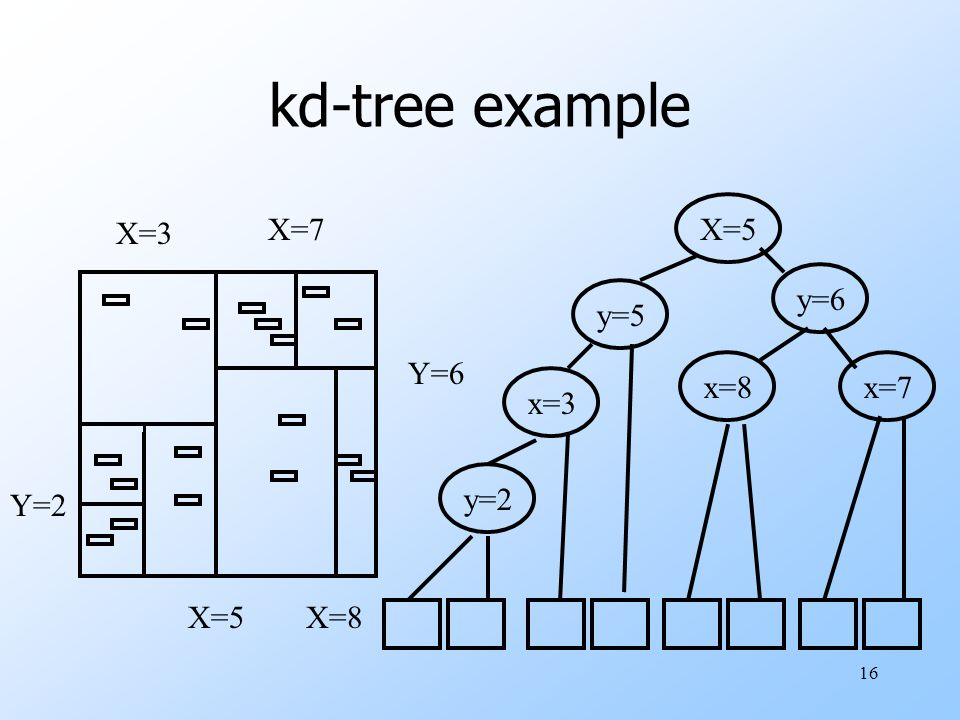

### Topic : Indexing the spatial data and temporal data

---

Spatial data is the geospatial data information that represent the physical location and shape of geometric object.

Indexing is done because to have the efficient quaring and retrival of data.

There are several types of spatial indexing :

1. R-tree is a data structure used for storing spatial data indexes in an efficient manner. It is highly useful for spatial data queries and storage.

   

2. Quad tree are trees used to efficiently store data of points on a two-dimensional space. In this tree, each node has at most four children.
   

3. Geohash is a technique used in databases to efficiently store and retrieve data based on their geographic location. It involves indexing the spatial data in a database using a specialized data structure that can quickly identify which objects or data points are located within a particular geographic region.
   

4. KD-tree is a binary tree in which each node represents a k-dimensional point. Every non-leaf node in the tree acts as a hyperplane, dividing the space into two partitions.

   

Temporal data stores data relating to time instances and it offers temporal data types and stores information relating to past,present and future time. 

**Types of Temporal Data**

Temporal data can be categorized into two main types:

Valid Time: Represents the period during which a fact is true or valid.

Transaction Time: Records the time at which a transaction or event occurred.

### Topic : Bitmap Indices
---
Bitmap Indexing is a data indexing technique used in database management systems (DBMS) to improve the performance of read-only queries that involve large datasets. It involves creating a bitmap index, which is a data structure that represents the presence or absence of data values in a table or column.

A bitmap is the combination of two words: bit and map. A bit can be termed as the smallest unit of data in a computer and a map can be termed as a way of organizing things.

Bit: A bit is a basic unit of information used in computing that can have only one of two values either 0 or 1. The two values of a binary digit can also be interpreted as logical values true/false or Yes/No.

**Advantages of Bitmap Indexing**

Efficiency in terms of insertion deletion and updation.

Faster retrieval of records

**Disadvantages of Bitmap Indexing**

Only suitable for large tables

Bitmap Indexing is time-consuming

### Topic : Buffer Tree
---

Buffer tree index is a dynamic index structure that uses buffer to filter candidate data blocks from disk and retrieve target data blocks directly, which significantly reduces the I/O operations and improves the query efficiency.

The buffer tree DBMS consists of four main components:

Buffer Tree: A hierarchical index structure that stores data block metadata, including block address, last access time, and access frequency. The buffer tree is organized as a B-tree, with the root node in memory and the leaf nodes on disk.

Buffer Pool: A memory area that stores frequently accessed data blocks. The buffer pool is managed by a replacement algorithm, such as LRU (Least Recently Used) or CLOCK, to ensure that the most frequently accessed data blocks are kept in memory.

Disk Manager: A component that manages the physical storage of data blocks on disk. The disk manager provides an interface for reading and writing data blocks to and from disk.

Query Processor: A component that parses and executes queries. The query processor uses the buffer tree to filter candidate data blocks from disk and retrieve target data blocks directly from the buffer pool or disk.