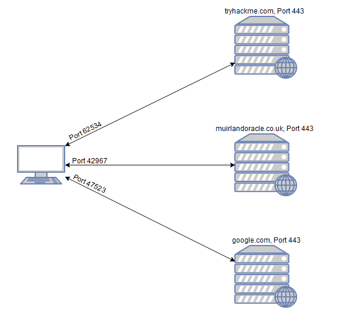
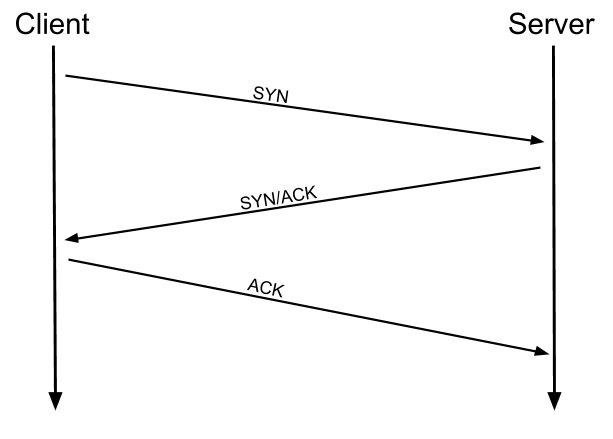
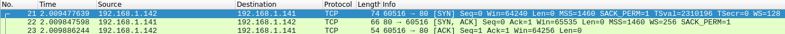
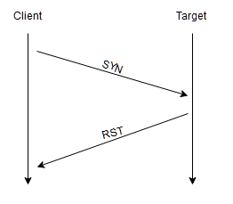
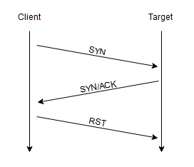
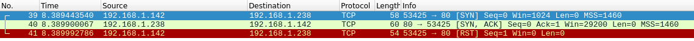
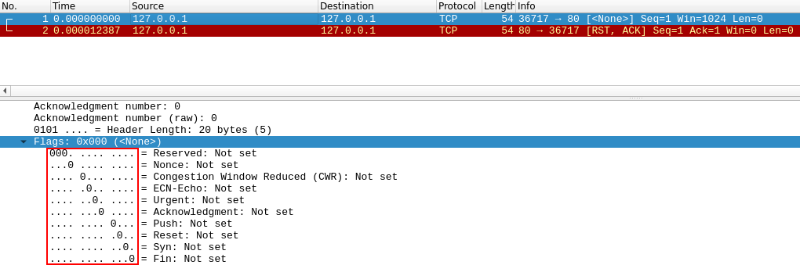
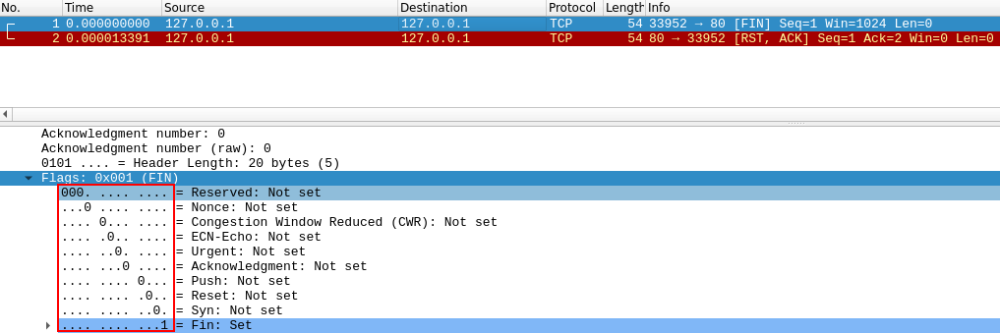
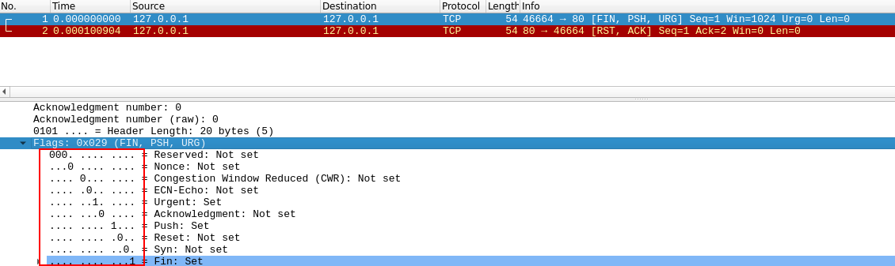

## Nmap
An in depth look at scanning with Nmap, a powerful network scanning tool.
---
# TASK 1 #

before doing anything else we need to establish which server are running on the targets. 

the first stage of attacking is called port scanning because when a computer runs a network services it opens a networking construct called a port to receive the connection and ports are important for making multiple network request or have multiple services available. the ports are used for communication with the server. Every  computer has a total of 65535 ports and many of them are registered as standard ports.

If we do not know which of these ports a server has open, then we do not have a hope of successfully attacking the target; thus, it is crucial that we begin any attack with a port scan. To accomplish the port scan , a tool called nmap is used. WHere nmap can be used to perform many different kinds of port scan. when scanning the port using nmap it depends on the port respond being open, closed or filtered(firewall).

Questions

1) What networking constructs are used to direct traffic to the right application on a server? ⇒ ports

2) How many of these are available on any network-enabled computer? ⇒ 65535

3) **[Research]** How many of these are considered "well-known"? (These are the "standard" numbers mentioned in the task) ⇒ 1024

# TASK 2 #

What is the first switch listed in the help menu for a 'Syn Scan' (more on this later!)? ⇒ -sS

Which switch would you use for a "UDP scan"? ⇒ -sU

If you wanted to detect which operating system the target is running on, which switch would you use? ⇒ -O

Nmap provides a switch to detect the version of the services running on the target. What is this switch? ⇒ -sV

The default output provided by nmap often does not provide enough information for a pentester. How would you increase the verbosity? ⇒ -V

Verbosity level one is good, but verbosity level two is better! How would you set the verbosity level to two? ⇒ -vV

We should always save the output of our scans -- this means that we only need to run the scan once (reducing network traffic and thus chance of detection), and gives us a reference to use when writing reports for clients.

What switch would you use to save the nmap results in three major formats? ⇒ -oA

What switch would you use to save the nmap results in a "normal" format? ⇒ -oN

A very useful output format: how would you save results in a "grepable" format? ⇒ -oG

Sometimes the results we're getting just aren't enough. If we don't care about how loud we are, we can enable "aggressive" mode. This is a shorthand switch that activates service detection, operating system detection, a traceroute and common script scanning.

How would you activate this setting? ⇒ -A

Nmap offers five levels of "timing" template. These are essentially used to increase the speed your scan runs at. Be careful though: higher speeds are noisier, and can incur errors!

How would you set the timing template to level 5? ⇒> -T5

We can also choose which port(s) to scan. How would you tell nmap to only scan port 80? ⇒ -p 80

How would you tell nmap to scan ports 1000-1500? ⇒ -p 1000-1500

How would you tell nmap to scan *all* ports? ⇒ -p-

How would you activate a script from the nmap scripting library (lots more on this later!)? —script-

How would you activate all of the scripts in the "vuln" category? —script=vuln

when port scanning with nmap there are three basic types scan.

TCP connect scan(-sT)

SYN scan (-sS)

UDP scan (-sU)

There are also less common port scan types,

TCP Null scan(-sN)

TCP FIN scan(-sF)

TCP Xmas scan(-sX)

# TCP Connect scans #

To understand the TCP connect scan it’s important to understand the three way handshake. The three way handshake consist of three connecting phase. First the terminal sends a TCP request to the target server with the SYN flag. The server acknowledges the packet with a TCP response containing the SYN flag and ACK flag. In the final process of handshake the terminal sends a TCP request with the ACK flag set.

if the nmap sends a TCP request with the SYN flag set to be a closed port , the target server will respond with a TCP packet with the RST(reset) flag and nmap will establish that the port is closed. 

in the third case if the port is open and hidden behind the fire wall, even though nmap sends a TCP SYN request but it does’t receive nothing back indicating that the port is protected by firewall and considered to be filtered. 

Which RFC defines the appropriate behaviour for the TCP protocol? ⇒ RFC 9293

If a port is closed, which flag should the server send back to indicate this? ⇒ RST

# SYN scans #

Like TCP scans,SYN scan is used to scan the port range to targets but SYN works slightly different as Half open scans or stealth scans.

Where TCP scans perform a full three-way handshake with the target, SYN scans sends back a RST TCP packet after receiving a SYN/ACK from the server

This has a variety of advantages for us as hackers:

- It can be used to bypass older Intrusion Detection systems as they are looking out for a full three way handshake. This is often no longer the case with modern IDS solutions; it is for this reason that SYN scans are still frequently referred to as "stealth" scans.
- SYN scans are often not logged by applications listening on open ports, as standard practice is to log a connection once it's been fully established. Again, this plays into the idea of SYN scans being stealthy.
- Without having to bother about completing (and disconnecting from) a three-way handshake for every port, SYN scans are significantly faster than a standard TCP Connect scan.

There are, however, a couple of disadvantages to SYN scans, namely:

- They require sudo permissions in order to work correctly in Linux. This is because SYN scans require the ability to create raw packets (as opposed to the full TCP handshake), which is a privilege only the root user has by default.

- Unstable services are sometimes brought down by SYN scans, which could prove problematic if a client has provided a production environment for the test.

If a port is closed then the server responds with a RST TCP packet. If the port is filtered by a firewall then the TCP SYN packet is either dropped, or spoofed with a TCP reset.

There are two other names for a SYN scan, what are they? ⇒ Half-open,stealth 

Can Nmap use a SYN scan without Sudo permissions (Y/N)? ⇒ N

# UDP scans #
UDP scans are stateless meaning it rely on sending packets to a target port and essentially hoping that they make it.  The switch for an nmap scan is -sU.

When sending a packet to an open UDP port , there are usually no response and nmap refers this port as open|filtered meaning it is firewalled. 

When sending a packet to an closed UDP port, the target respond with an ICMP(ping) packet containing a message that the port is unreachable. 

So the UDP scans is incredibly slow compare to other TCP scans it is better to run an nmap scan with top-ports <number> (nmap -sU —top-ports 20 <target>). 

If a UDP port doesn't respond to an Nmap scan, what will it be marked as? ⇒ open|filtered

When a UDP port is closed, by convention the target should send back a "port unreachable" message. Which protocol would it use to do so? ⇒ ICMP

NULL scans (-sN) are when the TCP request is sent with no flags set at all. As per the RFC, the target host should respond with a RST if the port is closed.

FIN scans (-sF) work in an almost identical fashion; however, instead of sending a completely empty packet, a request is sent with the FIN flag (usually used to gracefully close an active connection). Once again, Nmap expects a RST if the port is closed.

As with the other two scans in this class, Xmas scans (-sX) send a malformed TCP packet and expects a RST response for closed ports. It's referred to as an xmas scan as the flags that it sets (PSH, URG and FIN) give it the appearance of a blinking christmas tree when viewed as a packet capture in Wireshark.

Which of the three shown scan types uses the URG flag? ⇒ Xmas

Why are NULL, FIN and Xmas scans generally used? ⇒ firewall evasion

Which common OS may respond to a NULL, FIN or Xmas scan with a RST for every port? ⇒ Microsoft Windows 

# Task 9 

How would you perform a ping sweep on the 172.16.x.x network (Netmask: 255.255.0.0) using Nmap? (CIDR notation) ⇒ nmap -sn 172.16.0.0.1/16

# Task 10

What language are NSE scripts written in? ⇒Lua

Which category of scripts would be a *very* bad idea to run in a production environment? ⇒ intrusive

# Task 11

What optional argument can the **`ftp-anon.nse`** script take? ⇒ maxlist

# Task 12

Search for "smb" scripts in the **`/usr/share/nmap/scripts/`**directory using either of the demonstrated methods.
What is the filename of the script which determines the underlying OS of the SMB server? = > *smb*-*os*-discovery.nse

Read through this script. What does it depend on? ⇒ smb-brute

# Task 13

Which simple (and frequently relied upon) protocol is often blocked, requiring the use of the **`-Pn`** switch? ⇒ ICMP

**[Research]** Which Nmap switch allows you to append an arbitrary length of random data to the end of packets? ⇒ —data-length

Task 13

Which simple (and frequently relied upon) protocol is often blocked, requiring the use of the **`-Pn`** switch? ⇒ ICMP

**[Research]** Which Nmap switch allows you to append an arbitrary length of random data to the end of packets? ⇒ —data-length 

# Task 14

Does the target ip respond to ICMP echo (ping) requests (Y/N)? ⇒ N

Perform an Xmas scan on the first 999 ports of the target -- how many ports are shown to be open or filtered? ⇒ 999

There is a reason given for this -- what is it?

**Note:** The answer will be in your scan results. Think carefully about which switches to use -- and read the hint before asking for help! ⇒ no responses 

Perform a TCP SYN scan on the first 5000 ports of the target -- how many ports are shown to be open? ⇒ 5

Open Wireshark (see [Cryillic's](https://tryhackme.com/p/Cryillic) [Wireshark Room](https://tryhackme.com/room/wireshark) for instructions) and perform a TCP Connect scan against port 80 on the target, monitoring the results. Make sure you understand what's going on. Deploy the **`ftp-anon`** script against the box. Can Nmap login successfully to the FTP server on port 21? (Y/N) ⇒ Y