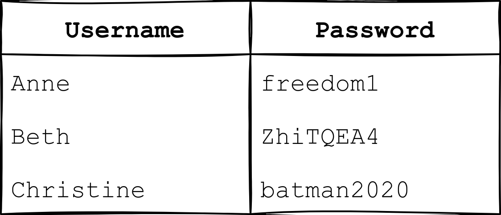

## Web Application

A web application is like a program that we can use without installation as long as we have a modern standard web browser.

The following are some examples of web applications:

- Webmail such as Tutanota, Protonmail, Outlook, and Gmail
- Online office suites such as Microsoft Office 365 (Word, Excel, and PowerPoint), Google Drive (Docs, Sheets, and Slides), and Zoho Office (Writer, Sheet, and Show)
- Online shopping such as Amazon.com, AliExpress, and Etsy

Web application is the program running on a remote server and a server is a computer system running continuously to serve the client.

Example , for online shopping application it will read the data about the products and their details from a database server. So for the online shopping web applications it will need more than one database to assess.

- Products database: This database contains details about the products, such as name, images, specifications, and price.
- Customers database: It contains all details related to customers, such as name, address, email, and phone number.
- Sales database: We expect to see what each customer has purchased and how they paid in this database.

What do you need to access a web application? ⇒ browser

## Web application security risk.

following is the function that we expect to be able to do on web server

There are few main categories of common attacks web application as follows,

- Log in at the website: The attacker can try to discover the password by trying many words. The attacker would use a long list of passwords with an automated tool to test them against the login page.
- Search for the product: The attacker can attempt to breach the system by adding specific characters and codes to the search term. The attacker’s objective is for the target system to return data it should not or execute a program it should not.
- Provide payment details: The attacker would check if the payment details are sent in cleartext or using weak encryption. Encryption refers to making the data unreadable without knowing the secret key or password.

## Identification and authentication failure

Identification refers to the ability to identify a user uniquely and authentication refers to the ability to prove that users is whom they claim to be. So the online shopping must confirm the user’s identity and authenticate them before they can use the system. But this step is prone to different types of weakness as follows.

- Allowing the attacker to use brute force, i.e., try many passwords, usually using automated tools, to find valid login credentials.
- Allowing the user to choose a weak password. A weak password is usually easy to guess.
- Storing the users’ passwords in plain text. If the attacker manages to read the file containing the passwords, we don’t want them to be able to learn the stored password.

## Broken access control

Access control ensures that each user can only access files (documents, images, etc.) related to their role or work.

Example vulnerabilities related to access control include:

- Failing to apply *the principle of the least privilege* and giving users more access permissions than they need. For example, an online customer should be able to view the prices of the items, but they should not be able to change them.
- Being able to view or modify someone else’s account by using its unique identifier. For example, you don’t want one bank client to be able to view the transactions of another client.
- Being able to browse pages that require authentication (logging in) as an unauthenticated user. For example, we cannot let anyone view the webmail before logging in.

## Injection

An injection attack refers to a vulnerability in the web application where the user can insert malicious code as part of their input. One cause of this vulnerability is the lack of proper validation and sanitization of the user’s input.

## Cryptographic Failures

Cryptographic failure is related to cryptography. Cryptography focuses on the processes of encryption and decryption of data. Encryption scrambles cleartext into ciphertext, which should be gibberish to anyone who does not have the secret key to decrypt it. encryption ensures that no one can read the data without knowing the secret key. Decryption converts the ciphertext back into the original cleartext using the secret key.

Examples of cryptographic failures include:

- Sending sensitive data in clear text, for example, using HTTP instead of HTTPS. HTTP is the protocol used to access the web, while HTTPS is the secure version of HTTP. Others can read everything you send over HTTP, but not HTTPS.
- Relying on a weak cryptographic algorithm. One old cryptographic algorithm is to shift each letter by one. For instance, “TRY HACK ME” becomes “USZ IBDL NF.” This cryptographic algorithm is trivial to break.
- Using default or weak keys for cryptographic functions. It won’t be challenging to break the encryption that used **`1234`** as the secret key.

You discovered that the login page allows an unlimited number of login attempts without trying to slow down the user or lock the account. What is the category of this security risk?

⇒ identification and authentication failure

You noticed that the username and password are sent in cleartext without encryption. What is the category of this security risk?

⇒ cryptographic failures

## Practical Example of Web Application Security

Click on “View Site,” and let’s see this in action. You will see a page showing an Inventory Management System. If you click on the “Planned Shipments” tab, you will discover that an attacker has managed to mix things up as part of sabotage plans. Notice how they send the wrong tires to each assembly line; for instance, they assign scooter tires and motorcycle tires to bike assembly! If left unfixed, all tires will go to the wrong assembly.

We will hack the system back and undo the attacker’s steps. On “Your Activity,” you can see the activity of one of the users. We have reason to believe that this website has an IDOR vulnerability.

Check the other users to discover which user account was used to make the malicious changes and revert them. After reverting the changes, what is the flag that you have received?

⇒ THM{IDOR_EXPLORED}
