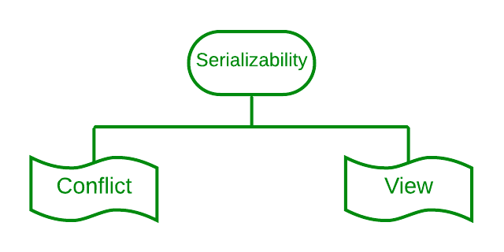

## Topic : Transaction

It is defined as a set of logically related operations and results of a request made by the user to access the contents of the database and perform operations on it.

It also has some specific properties that must be followed to keep the database consistent.

# Operations of Transaction

1. Read(X)
   used to read the value of X from the database and store it in a buffer in the main memory for further actions such as displaying that value. Such an operation is performed when a user wishes just to see any content of the database and not make any changes to it.

2. Write(X)
   used to write the value to the database from the buffer in the main memory. For a write operation to be performed, first a read operation is performed to bring its value in buffer, and then some changes are made to it,

3. Commit
   used to maintain integrity in the database. Due to some failure of power, hardware, or software, etc., a transaction might get interrupted before all its operations are completed. This may cause ambiguity in the database, i.e. it might get inconsistent before and after the transaction.

4. Rollback
   performed to bring the database to the last saved state when any transaction is interrupted in between due to any power, hardware, or software failure. In simple words, it can be said that a rollback operation does undo the operations of transactions that were performed before its interruption to achieve a safe state of the database and avoid any kind of ambiguity or inconsistency.

Example on transaction:
Created a database called test transaction and created a table called account with the input value A having 1000 as balance and B having the balance 2000 and begin to update the balance where the account name A. 

Now here the transaction begins where the balance from the account A had transaction of 100 and the balance was updated to 900. 

Here the new transaction was started but however the transaction was already in progress and the commit command was is issued but the rollback is automatically performed to ensure that the transaction is atomicity.

The insert command successfully added a new row and now the table has three records.

The update command successfully identified and attempted to modify the row but the subsequent rollback command undo the change and after the rollback the table remains unchanged showing the initial balances for all the accounts.

## Properties of Transaction

1. Atomicity

This property ensures that either all operations of a transaction are executed or it is aborted. Atomicity is achieved through commit and rollback operations, i.e. changes are made to the database only if all operations related to a transaction are completed, and if it gets interrupted, any changes made are rolled back using rollback operation to bring the database to its last saved state.

2. Consistency

This property of a transaction keeps the database consistent before and after a transaction is completed. Execution of any transaction must ensure that after its execution, the database is either in its prior stable state or a new stable state.

3. Isolation

This property states that two transactions must not interfere with each other, i.e. if some data is used by a transaction for its execution, then any other transaction can not concurrently access that data until the first transaction has completed. 

4. Durability

This property ensures that the changes made to the database after a transaction is completely executed, are durable. It indicates that permanent changes are made by the successful execution of a transaction.

## Serializability
Serializability in DBMS ensures that multiple transactions can access and modify the same data without interfering with each other's operations. It helps to prevent data inconsistencies and anomalies that can occur when multiple transactions try to access and modify the same data concurrently.

In Serializability, multiple transactions produce the same results as if they were executed in sequential order. While Scheduling refers to the order in which the transactions are executed. 

The reason why Serializability is Important?

Data Integrity: Serializability ensures that the database remains in a valid and consistent state, preventing data corruption due to conflicting transactions.

Correctness of Results: It guarantees that the final outcome of concurrent transactions is the same as if they were executed in a specific serial order, ensuring the correctness of results.

Transaction Isolation: Serializability provides a degree of isolation between transactions, preventing one transaction from observing the partially completed state of another.

Serializability is divided in to two types:

Conflict serializability refers to a subset of serializability that focuses on maintaining the consistency of a database while ensuring that identical data items are executed in an order.

A conflict serializable schedule is always viewed as serializable, but vice versa is not always true.

View serializability is a kind of operation in a serializable in which each transaction should provide some results, and these outcomes are the output of properly sequentially executing the data item
