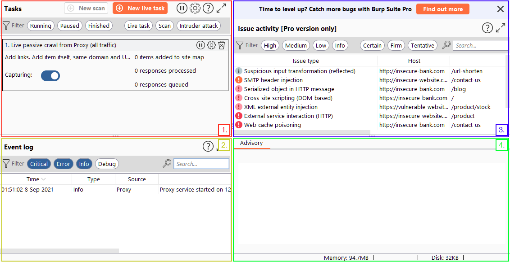
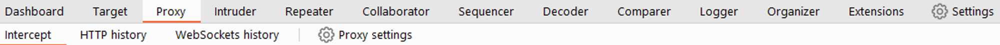
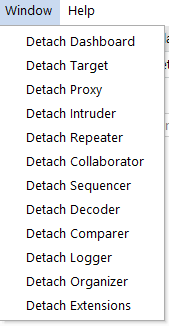
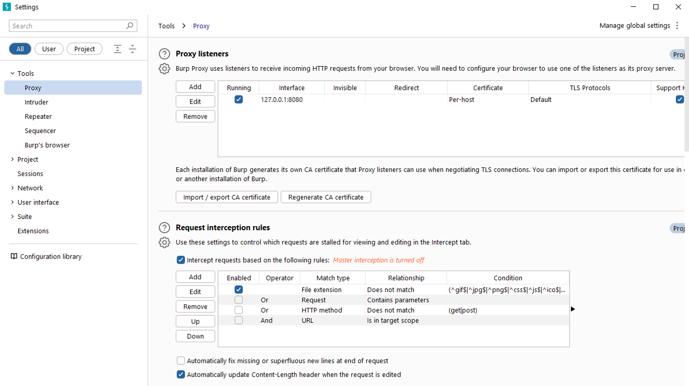

## Brup Suite: The Basics

Burp Suite is a Java-based framework designed to serve as a comprehensive solution for conducting web application penetration testing.

it has the industry standard tool for hands-on-security assessments of web and mobile applications.

it include those that rely on application programming interface(APIs)

By intercepting requests, users have the flexibility to route them to various components within the Burp Suite framework

Which edition of Burp Suite runs on a server and provides constant scanning for target web apps?

⇒ Burp suite enterprise

Burp Suite is frequently used when attacking web applications and **\_\_** applications.

⇒ Mobile

# Features of Burp Community

Some key features of burp suite;

- **Proxy**: The Burp Proxy is the most renowned aspect of Burp Suite. It enables interception and modification of requests and responses while interacting with web applications.
- **Repeater**: Another well-known feature. [Repeater](https://tryhackme.com/room/burpsuiterepeater) allows for capturing, modifying, and resending the same request multiple times. This functionality is particularly useful when crafting payloads through trial and error (e.g., in SQLi - Structured Query Language Injection) or testing the functionality of an endpoint for vulnerabilities.
- **Intruder**: Despite rate limitations in Burp Suite Community, [Intruder](https://tryhackme.com/room/burpsuiteintruder) allows for spraying endpoints with requests. It is commonly utilized for brute-force attacks or fuzzing endpoints.
- **Decoder**: [Decoder](https://tryhackme.com/room/burpsuiteom) offers a valuable service for data transformation. It can decode captured information or encode payloads before sending them to the target. While alternative services exist for this purpose, leveraging Decoder within Burp Suite can be highly efficient.
- **Comparer**: As the name suggests, [Comparer](https://tryhackme.com/room/burpsuiteom) enables the comparison of two pieces of data at either the word or byte level. While not exclusive to Burp Suite, the ability to send potentially large data segments directly to a comparison tool with a single keyboard shortcut significantly accelerates the process.
- **Sequencer**: [Sequencer](https://tryhackme.com/room/burpsuiteom) is typically employed when assessing the randomness of tokens, such as session cookie values or other supposedly randomly generated data. If the algorithm used for generating these values lacks secure randomness, it can expose avenues for devastating attacks.

Which Burp Suite feature allows us to intercept requests between ourselves and the target?

⇒ Proxy

Which Burp tool would we use to brute-force a login form?

⇒ Intruder

# The Dashboard

The Burp Dashboard is divided into four quadrants, as labelled in counter-clockwise order starting from the top left:

1. **Tasks**: The Tasks menu allows you to define background tasks that Burp Suite will perform while you use the application. In Burp Suite Community, the default “Live Passive Crawl” task, which automatically logs the pages visited, is sufficient for our purposes in this module. Burp Suite Professional offers additional features like on-demand scans.

2. **Event log**: The Event log provides information about the actions performed by Burp Suite, such as starting the proxy, as well as details about connections made through Burp.

3. **Issue Activity**: This section is specific to Burp Suite Professional. It displays the vulnerabilities identified by the automated scanner, ranked by severity and filterable based on the certainty of the vulnerability.

4. **Advisory**: The Advisory section provides more detailed information about the identified vulnerabilities, including references and suggested remediations. This information can be exported into a report. In Burp Suite Community, this section may not show any vulnerabilities.

What menu provides information about the actions performed by Burp Suite, such as starting the proxy, and details about connections made through Burp?

⇒ event log

# Navigation

Here's how the navigation works:

1. **Module Selection**: The top row of the menu bar displays the available modules in Burp Suite. You can click on each module to switch between them. For example, the Burp Proxy module is selected in the image below.

2. **Sub-Tabs**: If a selected module has multiple sub-tabs, they can be accessed through the second menu bar that appears directly below the main menu bar. These sub-tabs often contain module-specific settings and options. For example, in the image above, the Proxy Intercept sub-tab is selected within the Burp Proxy module.

3. Detaching Tabs: If you prefer to view multiple tabs separately, you can detach them into separate windows. To do this, go to the Window option in the application menu above the Module Selection bar. From there, choose the "Detach" option, and the selected tab will open in a separate window. The detached tabs can be reattached using the same method.

Burp Suite also provides keyboard shortcuts for quick navigation to key tabs. By default, the following shortcuts are available:

| Shortcut         | Tab          |
| ---------------- | ------------ |
| Ctrl + Shift + D | Dashboard    |
| Ctrl + Shift + T | Target tab   |
| Ctrl + Shift + P | Proxy tab    |
| Ctrl + Shift + I | Intruder tab |
| Ctrl + Shift + R | Repeater tab |

Which tab **Ctrl + Shift + P** will switch us to?

⇒ proxy tab

# Options

- **Global Settings**: These settings affect the entire Burp Suite installation and are applied every time you start the application. They provide a baseline configuration for your Burp Suite environment.

- **Project Settings**: These settings are specific to the current project and apply only during the session. However, please note that Burp Suite Community Edition does not support saving projects, so any project-specific options will be lost when you close Burp.

Below is the image showing the separate settings window.

In which category can you find a reference to a "Cookie jar"?

⇒ Sessions

In which base category can you find the "Updates" sub-category, which controls the Burp Suite update behaviour?

⇒ Suite

What is the name of the sub-category which allows you to change the keybindings for shortcuts in Burp Suite?

⇒ hotkeys

If we have uploaded Client-Side TLS certificates, can we override these on a per-project basis (yea/nay)?

⇒ yea

# Site Map and Issue Definitions

The **Target** tab in Burp Suite provides more than just control over the scope of our testing. It consists of three sub-tabs:

1. **Site map**: This sub-tab allows us to map out the web applications we are targeting in a tree structure. Every page that we visit while the proxy is active will be displayed on the site map. This feature enables us to automatically generate a site map by simply browsing the web application. In Burp Suite Professional, we can also use the site map to perform automated crawling of the target, exploring links between pages and mapping out as much of the site as possible. Even with Burp Suite Community, we can still utilize the site map to accumulate data during our initial enumeration steps. It is particularly useful for mapping out APIs, as any API endpoints accessed by the web application will be captured in the site map.
2. **Issue definitions**: Although Burp Community does not include the full vulnerability scanning functionality available in Burp Suite Professional, we still have access to a list of all the vulnerabilities that the scanner looks for. The **Issue definitions** section provides an extensive list of web vulnerabilities, complete with descriptions and references. This resource can be valuable for referencing vulnerabilities in reports or assisting in describing a particular vulnerability that may have been identified during manual testing.
3. **Scope settings**: This setting allows us to control the target scope in Burp Suite. It enables us to include or exclude specific domains/IPs to define the scope of our testing. By managing the scope, we can focus on the web applications we are specifically targeting and avoid capturing unnecessary traffic.

What is the flag you receive after visiting the unusual endpoint?

⇒ *THM{NmNlZTliNGE1MWU1ZTQzMzgzNmFiNWVk*}