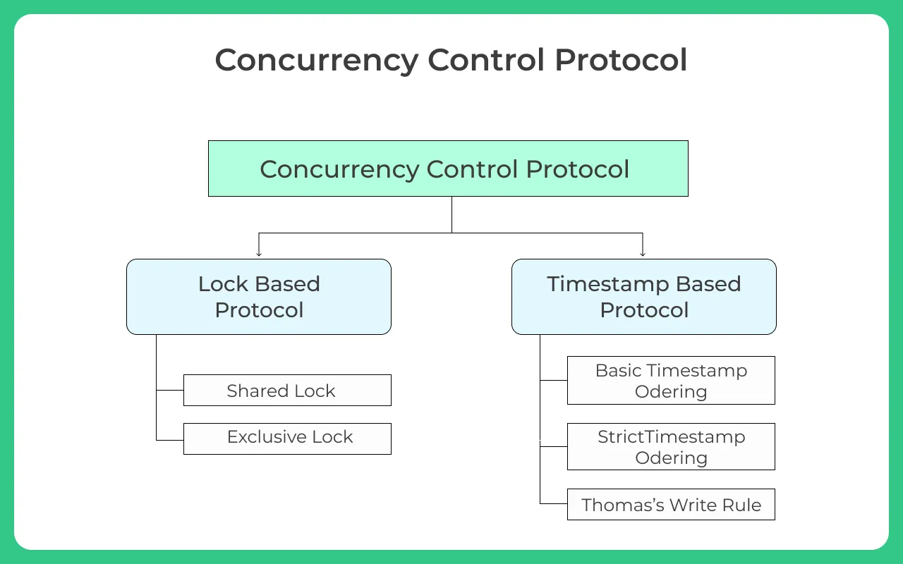
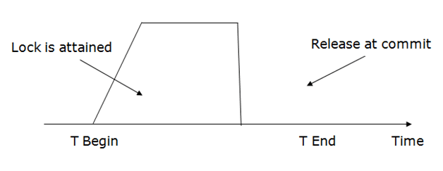
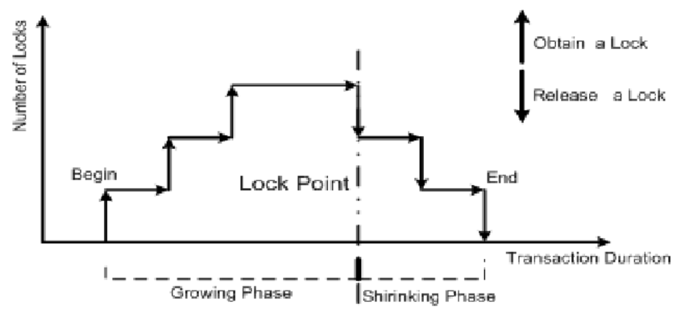
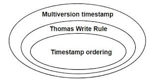
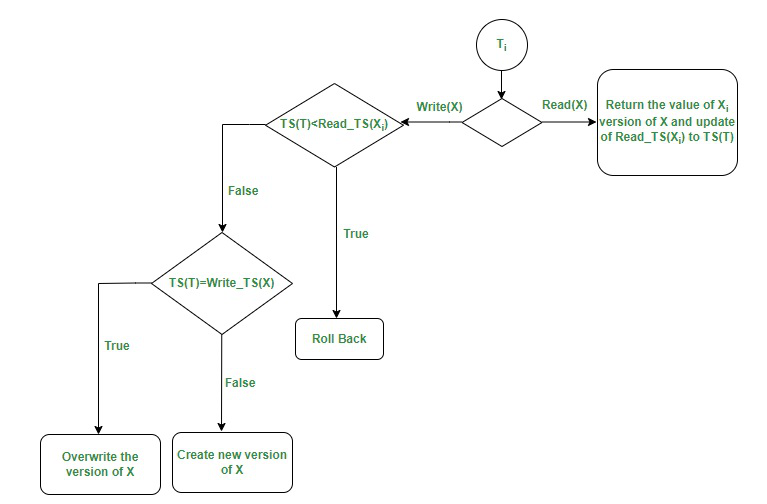
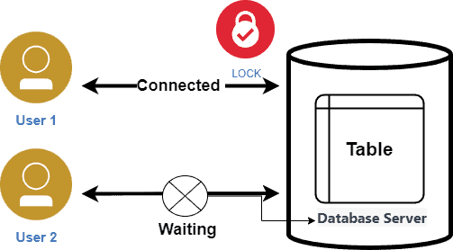

## Topic : Concurrency Control

Concurrency control is two or more things capable of operating or occuring at the at the same time. It ensure that simultaneous transactions will be parsed appropriately.

Imagine a scenario where multiple users are trying to access and modify the same data at the same time. Without proper concurrency control, you could face issues like:

- Lost updates: Two users might update the same data independently, overwriting each other's changes.
- Dirty reads: One user might read data that hasn't been committed yet, leading to inconsistencies.
- Inconsistent retrievals: Different users might see different versions of the data, causing confusion.

To prevent these problems, concurrency control mechanisms are employed. These mechanisms ensure that transactions, which are units of work on the data, are executed in a way that preserves data integrity.

Key Concepts:

- Transaction: A logical unit of work that encompasses a series of operations on the data.
  Concurrency: Multiple transactions executing simultaneously.
- Atomicity: A transaction is either fully completed or fully rolled back, ensuring its effects are all-or-nothing.
- Consistency: Transactions maintain data integrity by adhering to pre-defined rules and constraints.
- Isolation: Each transaction operates independently, as if it were the only one accessing the data.
- Durability: Once a transaction is committed, its changes are permanently stored and survive system failures.

## Two phase locking

Locking is used for handling transactions in database. The two phase locking protocol ensures serializable conflict schedules.

Two-Phase Locking (2PL) is a concurrency control protocol used in database management systems (DBMS) to ensure data consistency and prevent data corruption during concurrent transactions.

The two phases of 2PL:

- Growing Phase: Transactions can acquire locks, but cannot release any. This phase continues until the transaction acquires all the locks it needs to complete its operations.

- Shrinking Phase: Transactions can release locks, but cannot acquire any new locks. This phase starts after the growing phase, and the transaction continues to release locks until it completes.

Types of locks in 2PL:

- Shared Lock (S Lock): Allows multiple transactions to read a data item concurrently.
- Exclusive Lock (X Lock): Allows only one transaction to modify (read and write) a data item.

How 2PL Works:

- A transaction requests a lock on a data item.
- The DBMS grants the lock based on the type of lock requested (S or X) and the current lock status of the data item.
- The transaction performs its operations on the data item.
- The transaction releases all the locks it acquired.

Benefits of 2PL:

- Serializability: 2PL ensures that the concurrent execution of transactions is equivalent to some serial execution of those transactions, preventing data inconsistency.
- Data Consistency: It guarantees that transactions see a consistent view of the data, even if other transactions are modifying the data concurrently.
- Deadlock Prevention: 2PL helps reduce the likelihood of deadlocks, which occur when transactions wait indefinitely for each other to release locks.

Types of 2PL:

- Strict 2PL: Transactions release all locks only after they commit or abort. This provides the strongest guarantee of serializability.
- Rigorous 2PL: Similar to strict 2PL, but transactions release locks only after they commit. This provides even stronger protection against data inconsistency.

## Timestamp Ordering Protocol for Concurrency Control

Timestamp ordering protocols are a class of concurrency control techniques that use timestamps to order and validate transactions

It works by assigning timestamps to transactions and using these timestamps to determine the order in which operations are executed.

Here's how it works:

- Transaction Start: When a transaction begins, it is assigned a unique timestamp. This timestamp is usually generated based on the system's internal clock.

- Operation Execution: Every operation performed by a transaction is associated with the transaction's timestamp.

- Read Operations: When a transaction reads a data item, the timestamp of the transaction is compared to the timestamp of the latest transaction that wrote the data. If the reading transaction's timestamp is older, it means the data item may be outdated. The transaction is then either:

  - Blocked: The transaction is blocked until the latest writing transaction commits or aborts.
  - Rolled Back: The transaction is rolled back to prevent inconsistent data.

- Write Operations: When a transaction writes a data item, the timestamp is compared to the timestamp of the last transaction that wrote the data.

  - Timestamp Conflict: If the transaction's timestamp is older than the last write timestamp, the transaction is rolled back, as this would violate the order of operations.
  - Timestamp Agreement: If the transaction's timestamp is newer than the last write timestamp, the write operation proceeds, updating the last write timestamp.

Advantages:

- Simplicity: It is relatively straightforward to implement.
- High Concurrency: It allows for a high degree of concurrent transactions, as long as the timestamps are well-ordered.
- Easy to understand: The concept of timestamps and their use for ordering is intuitive.

Disadvantages:

- Blocking: Transactions can be blocked if their timestamps conflict with other transactions, potentially leading to reduced performance.
- Deadlock Potential: While less common than other protocols, there is a potential for deadlocks in situations involving complex transaction dependencies.
- Timestamp Management: Maintaining consistent and accurate timestamps across a distributed system can be challenging.

## Lock and Latch

Lock and latch are concurrency control mechanisms in a Database Management System (DBMS) that are used to prevent data corruption and ensure data integrity during concurrent transactions.

Locks:

- Purpose: Used to control access to data at a granularity level (row, page, table, etc.).
- Duration: Held for a longer duration (from milliseconds to seconds or even minutes).
- Type: Can be shared (allowing multiple transactions to read data) or exclusive (allowing only one transaction to modify data).
- Mechanism: Implemented using software mechanisms that are typically part of the DBMS.

Latches:

- Purpose: Used to control access to system structures like buffer pages, internal data structures, or other resources.
- Duration: Held for a very short duration (microseconds or nanoseconds).
- Type: Always exclusive.
- Mechanism: Implemented using hardware mechanisms like spinlocks or semaphores.

How Locks and Latches Work Together

- Locks are acquired by transactions to prevent data inconsistency. They are held for longer durations, ensuring data integrity while the transaction is being processed.
- Latches are used by the DBMS itself to protect internal structures. They are held for very short durations, ensuring efficient access to the internal data structures.

