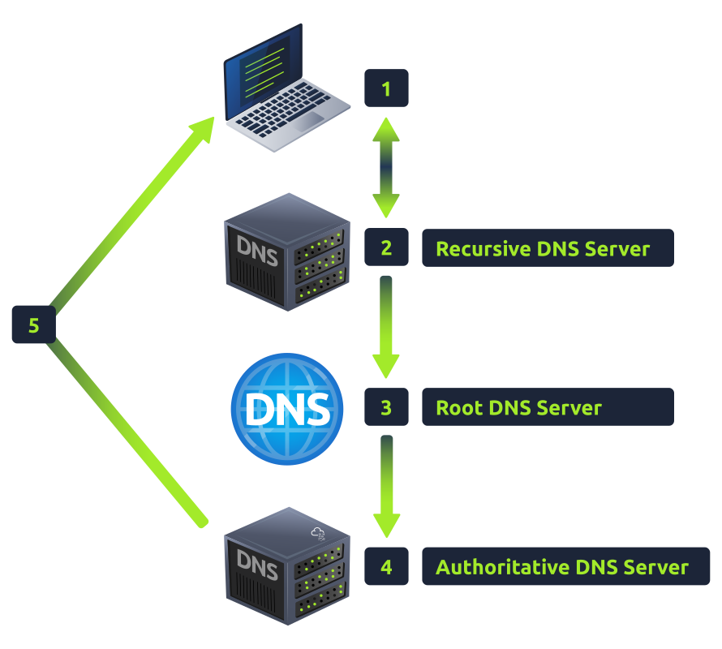
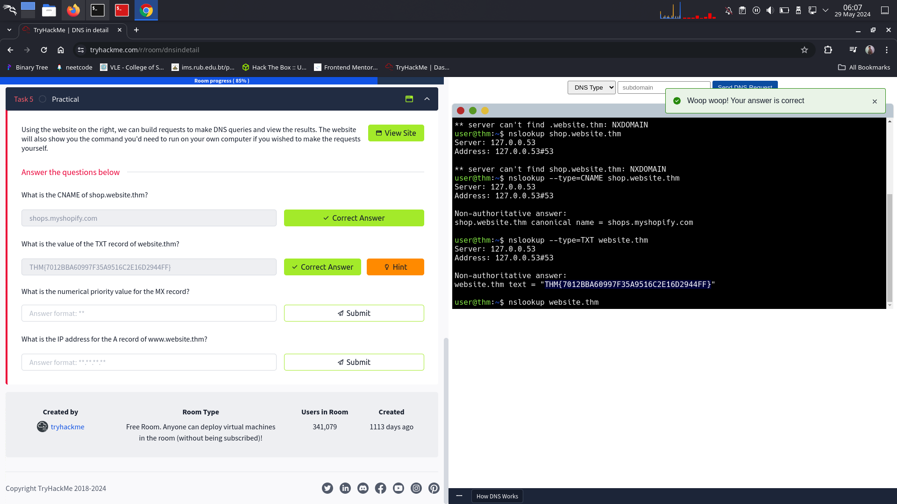
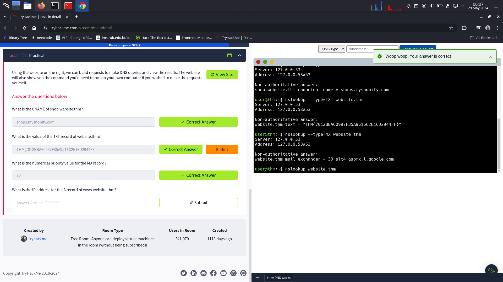
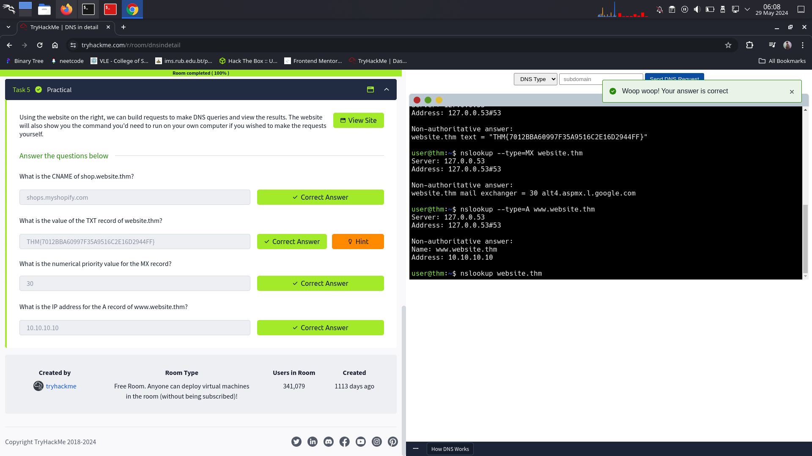

## DNS in detail

DNS stands for Domain name system that provides us the simple way to communicate with the devices on the internet without remembering complex number(IP address)

Each and every computer on the internet has its own unique address to communicate with. it is called IP address. 

When we want to visit a website it is not convenient to remember the complicated set of numbers. so the DNS helps us to remember the website name instate of the IP address.

What does DNS stand for? ⇒ Domain Name System

Domain Hierarchy

Top-Level Domain(TLD)  is the most righthand part of the a domain name and is divided into two types. 

gTLD (Generic Top Level) and ccTLD (Country Code Top Level Domain). Historically a gTLD was meant to tell the user the domain name's purpose; for example, a .com would be for commercial purposes, .org for an organisation, .edu for education and .gov for government. And a ccTLD was used for geographical purposes, for example, .ca for sites based in Canada, .co.uk for sites based in the United Kingdom and so on. Due to such demand, there is an influx of new gTLDs ranging from .online , .club , .website , .biz and so many more

Second-Level Domain

Taking tryhack me as an example, the .com part is the TLD, and tryhackme is the Second Level Domain. When registering a domain name, the second-level domain is limited to 63 characters + the TLD and can only use a-z 0-9 and hyphens (cannot start or end with hyphens or have consecutive hyphens).

**Subdomain**

A subdomain sits on the left-hand side of the Second-Level Domain using a period to separate it; for example, in the name admin.tryhackme.com the admin part is the subdomain. A subdomain name has the same creation restrictions as a Second-Level Domain

limited to 63 characters and can only use a-z 0-9 and hyphens (cannot start or end with hyphens or have consecutive hyphens).

What is the maximum length of a subdomain?⇒ 63

Which of the following characters cannot be used in a subdomain ( 3 b _ - )? ⇒ _

What is the maximum length of a domain name? ⇒ 253

What type of TLD is .co.uk? ⇒ ccTLD

**DNS Record Types**

**A Record**

These records resolve to IPv4 addresses, for example 104.26.10.229

**AAAA Record**

These records resolve to IPv6 addresses, for example 2606:4700:20::681a:be5

**CNAME Record**

These records resolve to another domain name, for example, TryHackMe's online shop has the subdomain name store.tryhackme.com which returns a CNAME record shops.shopify.com. Another DNS request would then be made to shops.shopify.com to work out the IP address.

**MX Record**

These records resolve to the address of the servers that handle the email for the domain you are querying, for example an MX record response for tryhackme.com would look something like alt1.aspmx.l.google.com. These records also come with a priority flag. This tells the client in which order to try the servers, this is perfect for if the main server goes down and email needs to be sent to a backup server.

**TXT Record**

TXT records are free text fields where any text-based data can be stored. TXT records have multiple uses, but some common ones can be to list servers that have the authority to send an email on behalf of the domain (this can help in the battle against spam and spoofed email). They can also be used to verify ownership of the domain name when signing up for third party services.

What type of record would be used to advise where to send email? ⇒ MX

What type of record handles IPv6 addresses? ⇒ AAAA

**What happens when you make a DNS request**

<!--  -->

1. When you request a domain name, your computer first checks its local cache to see if you've previously looked up the address recently; if not, a request to your Recursive DNS Server will be made.

2. A Recursive DNS Server is usually provided by your ISP, but you can also choose your own. This server also has a local cache of recently looked up domain names. If a result is found locally, this is sent back to your computer, and your request ends here (this is common for popular and heavily requested services such as Google, Facebook, Twitter). If the request cannot be found locally, a journey begins to find the correct answer, starting with the internet's root DNS servers.

3. The root servers act as the DNS backbone of the internet; their job is to redirect you to the correct Top Level Domain Server, depending on your request. If, for example, you request tryhack me the root server will recognise the Top Level Domain of .com and refer you to the correct TLD server that deals with .com addresses.

4. The TLD server holds records for where to find the authoritative server to answer the DNS request. The authoritative server is often also known as the nameserver for the domain.

5. An authoritative DNS server is the server that is responsible for storing the DNS records for a particular domain name and where any updates to your domain name DNS records would be made. Depending on the record type, the DNS record is then sent back to the Recursive DNS Server, where a local copy will be cached for future requests and then relayed back to the original client that made the request. DNS records all come with a TTL (Time To Live) value. This value is a number represented in seconds that the response should be saved for locally until you have to look it up again. Caching saves on having to make a DNS request every time you communicate with a server.

What field specifies how long a DNS record should be cached for? ⇒ TTL

What type of DNS Server is usually provided by your ISP? ⇒ Recursive 

What type of server holds all the records for a domain? ⇒ Authoritative

# Practical

What is the CNAME of shop.website.thm?

⇒ shops.myshopify.com

What is the value of the TXT record of website.thm?

⇒ THM{7012BBA60997F35A9516C2E16D2944FF}

What is the numerical priority value for the MX record?

⇒ 30

What is the IP address for the A record of www.website.thm?

⇒ 10.10.10.10

