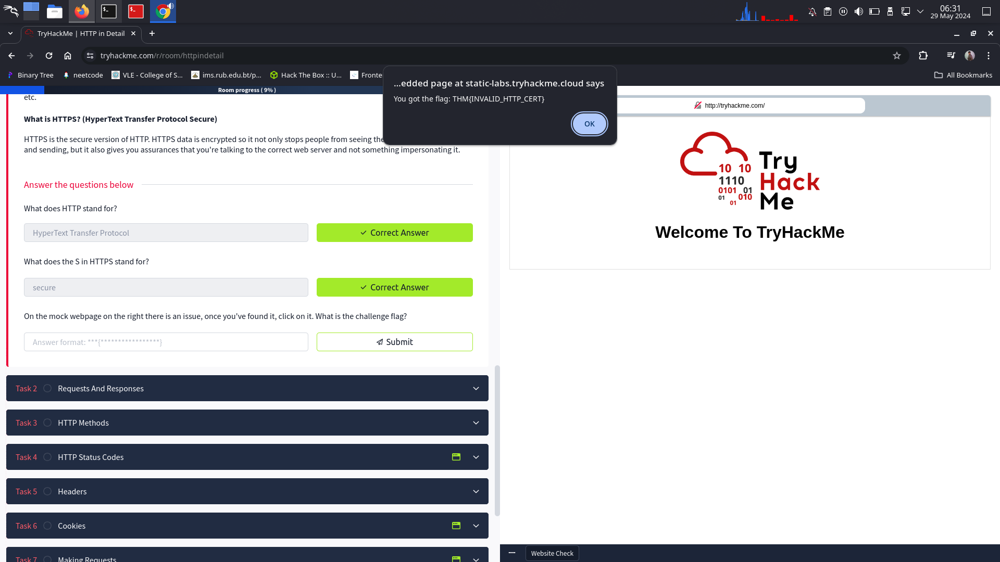
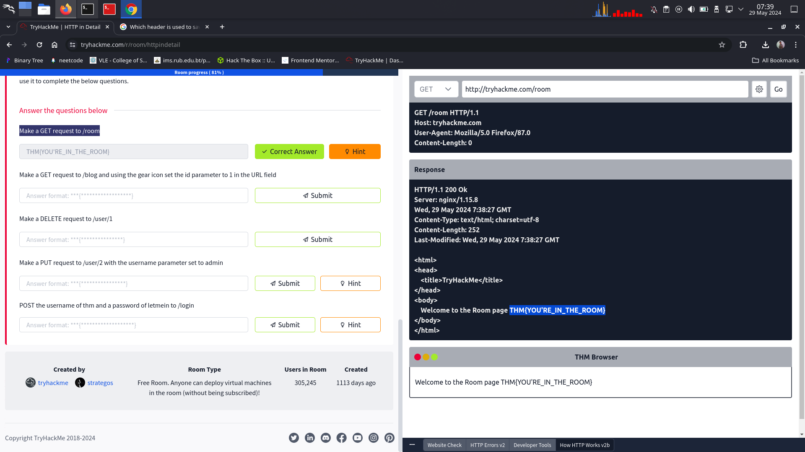
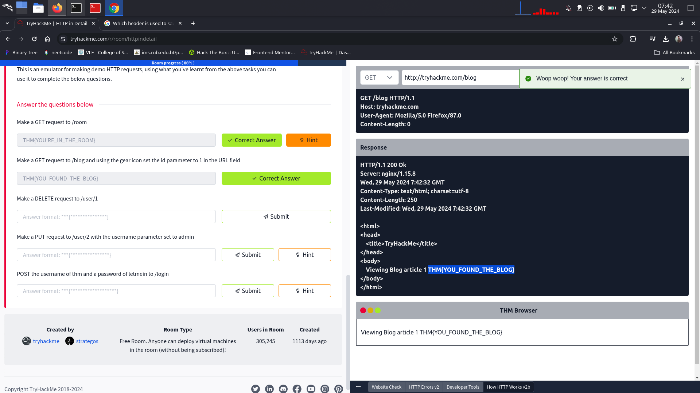
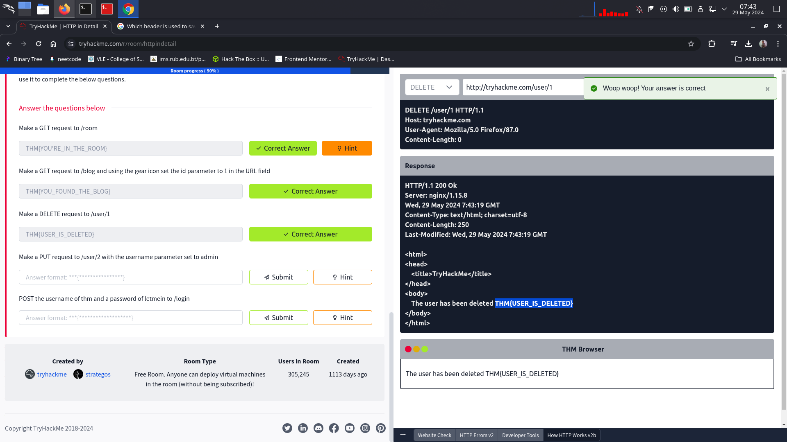
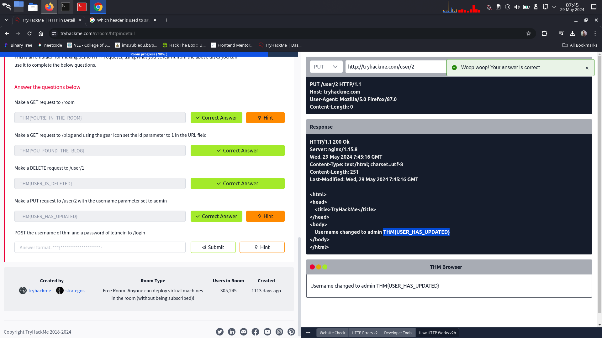
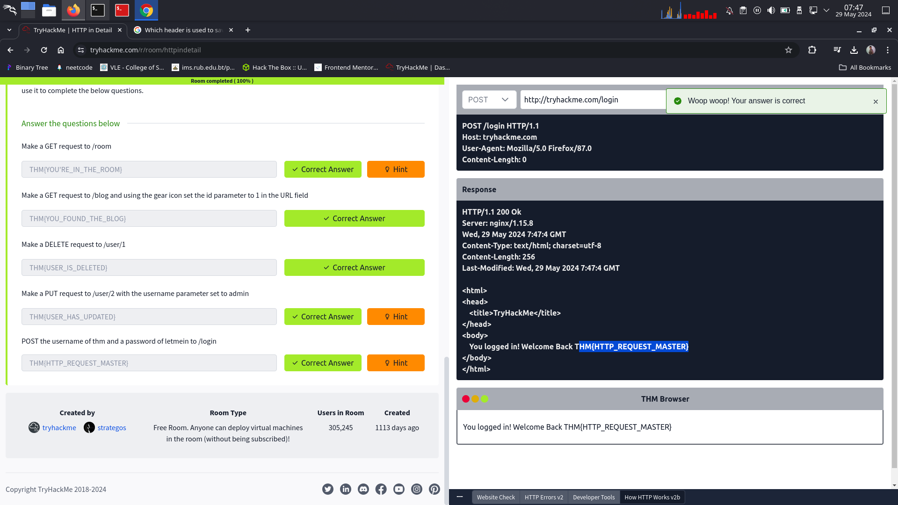

## HTTP in detail

HTTP is the set of rules used for communicating with web servers for the transmitting of webpage data, whether that is HTML, Images, Videos, etc.

HTTPS is the secure version of HTTP. HTTPS data is encrypted so it not only stops people from seeing the data you are receiving and sending, but it also gives you assurances that you're talking to the correct web server and not something impersonating it.

What does HTTP stand for?

⇒ **HyperText Transfer Protocol**

What does the S in HTTPS stand for?

⇒ Secure

On the mock webpage on the right there is an issue, once you've found it, click on it. What is the challenge flag?

⇒ THM{INVALID_HTTP_CERT}

<!--  -->

**Requests And Responses**

what is a URL ( Uniform resource locator)

<!--  -->

A URL is predominantly an instruction on how to access a resource on the internet. 

Scheme : This instructs on what protocol to use for accessing the resource such as HTTP, HTTPS, FTP (File Transfer Protocol).

**User:** Some services require authentication to log in, you can put a username and password into the URL to log in.

**Host:** The domain name or IP address of the server you wish to access.

**Port:** The Port that you are going to connect to, usually 80 for HTTP and 443 for HTTPS, but this can be hosted on any port between 1 - 65535.

**Path:** The file name or location of the resource you are trying to access.

**Query String:** Extra bits of information that can be sent to the requested path. For example, /blog?**id=1** would tell the blog path that you wish to receive the blog article with the id of 1.

**Fragment:** This is a reference to a location on the actual page requested. This is commonly used for pages with long content and can have a certain part of the page directly linked to it, so it is viewable to the user as soon as they access the page.

Making a request

It's possible to make a request to a web server with just one line "**GET / HTTP/1.1**"

Example request

GET / HTTP/1.1

Host: tashi.com

User-Agent: Mozilla/5.0 Firefox/87.0

Referer: https://tashi.com/

**Line 1:** This request is sending the GET method ( more on this in the HTTP Methods task ), request the home page with / and telling the web server we are using HTTP protocol version 1.1.

**Line 2:** We tell the web server we want the website tashi.com

**Line 3:** We tell the web server we are using the Firefox version 87 Browser

**Line 4:** We are telling the web server that the web page that referred us to this one is [https://tashi.com](https://tryhackme.com/)

**Line 5:** HTTP requests always end with a blank line to inform the web server that the request has finished.

Example Response

HTTP/1.1 200 OK

Server: nginx/1.15.8

Date: Fri, 09 Apr 2021 13:34:03 GMT

Content-Type: text/html

Content-Length: 98

<html>
<head>
    <title>Tashi</title>
</head>
<body>
    Welcome To Tashi.com
</body>
</html>

**Line 1:** HTTP 1.1 is the version of the HTTP protocol the server is using and then followed by the HTTP Status Code in this case "200 Ok" which tells us the request has completed successfully.

**Line 2:** This tells us the web server software and version number.

**Line 3:** The current date, time and timezone of the web server.

**Line 4:** The Content-Type header tells the client what sort of information is going to be sent, such as HTML, images, videos, pdf, XML.

**Line 5:** Content-Length tells the client how long the response is, this way we can confirm no data is missing.

**Line 6:** HTTP response contains a blank line to confirm the end of the HTTP response.

**Lines 7-14:** The information that has been requested, in this instance the homepage.

What HTTP protocol is being used in the above example? ⇒ HTTP/1.1

What response header tells the browser how much data to expect? ⇒ content-length

HTTP Methods

HTTP methods are a way for the client to show their intended action when making an HTTP request.

**GET Request**

This is used for getting information from a web server.

**POST Request**

This is used for submitting data to the web server and potentially creating new records

**PUT Request**

This is used for submitting data to a web server to update information

**DELETE Request**

This is used for deleting information/records from a web server.

What method would be used to create a new user account? ⇒ post

What method would be used to update your email address? ⇒ put

What method would be used to remove a picture you've uploaded to your account? ⇒ delete

What method would be used to view a news article? ⇒ get

HTTP Status code

Status code inform the client the outcome of their request and also potentially how to handle it.

| 100-199 - Information Response | These are sent to tell the client the first part of their request has been accepted and they should continue sending the rest of their request. These codes are no longer very common. |
| --- | --- |
| 200-299 - Success | This range of status codes is used to tell the client their request was successful. |
| 300-399 - Redirection | These are used to redirect the client's request to another resource. This can be either to a different webpage or a different website altogether. |
| 400-499 - Client Errors | Used to inform the client that there was an error with their request. |
| 500-599 - Server Errors | This is reserved for errors happening on the server-side and usually indicate quite a major problem with the server handling the request. |

**Common HTTP Status Codes:**

There are a lot of different HTTP status codes and that's not including the fact that applications can even define their own.

| 200 - OK | The request was completed successfully. |
| --- | --- |
| 201 - Created | A resource has been created (for example a new user or new blog post). |
| 301 - Moved Permanently | This redirects the client's browser to a new webpage or tells search engines that the page has moved somewhere else and to look there instead. |
| 302 - Found | Similar to the above permanent redirect, but as the name suggests, this is only a temporary change and it may change again in the near future. |
| 400 - Bad Request | This tells the browser that something was either wrong or missing in their request. This could sometimes be used if the web server resource that is being requested expected a certain parameter that the client didn't send. |
| 401 - Not Authorised | You are not currently allowed to view this resource until you have authorised with the web application, most commonly with a username and password. |
| 403 - Forbidden | You do not have permission to view this resource whether you are logged in or not. |
| 405 - Method Not Allowed | The resource does not allow this method request, for example, you send a GET request to the resource /create-account when it was expecting a POST request instead. |
| 404 - Page Not Found | The page/resource you requested does not exist. |
| 500 - Internal Service Error | The server has encountered some kind of error with your request that it doesn't know how to handle properly. |
| 503 - Service Unavailable | This server cannot handle your request as it's either overloaded or down for maintenance. |

What response code might you receive if you've created a new user or blog post article? ⇒ 201

What response code might you receive if you've tried to access a page that doesn't exist? ⇒ 404

What response code might you receive if the web server cannot access its database and the application crashes? ⇒ 503

What response code might you receive if you try to edit your profile without logging in first? ⇒ 401

**Common Request Headers**

These are headers that are sent from the client (usually your browser) to the server.

**Host:** Some web servers host multiple websites so by providing the host headers you can tell it which one you require, otherwise you'll just receive the default website for the server.

**User-Agent:** This is your browser software and version number, telling the web server your browser software helps it format the website properly for your browser and also some elements of HTML, JavaScript and CSS are only available in certain browsers.

**Content-Length:** When sending data to a web server such as in a form, the content length tells the web server how much data to expect in the web request. This way the server can ensure it isn't missing any data.

**Accept-Encoding:** Tells the web server what types of compression methods the browser supports so the data can be made smaller for transmitting over the internet.

**Cookie:** Data sent to the server to help remember your information (see cookies task for more information).

**Common Response Headers**

These are the headers that are returned to the client from the server after a request.

**Set-Cookie:** Information to store which gets sent back to the web server on each request (see cookies task for more information).

**Cache-Control:** How long to store the content of the response in the browser's cache before it requests it again.

**Content-Type:** This tells the client what type of data is being returned, i.e., HTML, CSS, JavaScript, Images, PDF, Video, etc. Using the content-type header the browser then knows how to process the data.

**Content-Encoding:** What method has been used to compress the data to make it smaller when sending it over the internet.

What header tells the web server what browser is being used? ⇒ user-agent

What header tells the browser what type of data is being returned? ⇒ content-type

What header tells the web server which website is being requested? ⇒ host

**Cookies**

Cookies are just a small piece of data that is stored in the computer. It is always saved when we receive a set cookie header from a web server. Cookie helps the web sever to remind who we are and some personal settings for the website or whether we have been to the website before or not.

<!--  -->

Cookies can be used for many purposes but are most commonly used for website authentication. The cookie value won't usually be a clear-text string where you can see the password, but a token (unique secret code that isn't easily humanly guessable).

Which header is used to save cookies to your computer? ⇒ set-cookie

Making Request

Make a GET request to /room

⇒ **THM{YOU'RE_IN_THE_ROOM}**

<!--  -->

Make a GET request to /blog and using the gear icon set the id parameter to 1 in the URL field

⇒ THM{YOU_FOUND_THE_BLOG}

<!--  -->

Make a DELETE request to /user/1

⇒ THM{USER_IS_DELETED}

<!--  -->

Make a PUT request to /user/2 with the username parameter set to admin

⇒ THM{USER_HAS_UPDATED}

<!--  -->

POST the username of thm and a password of letmein to /login

⇒ THM{HTTP_REQUEST_MASTER}

<!--  -->