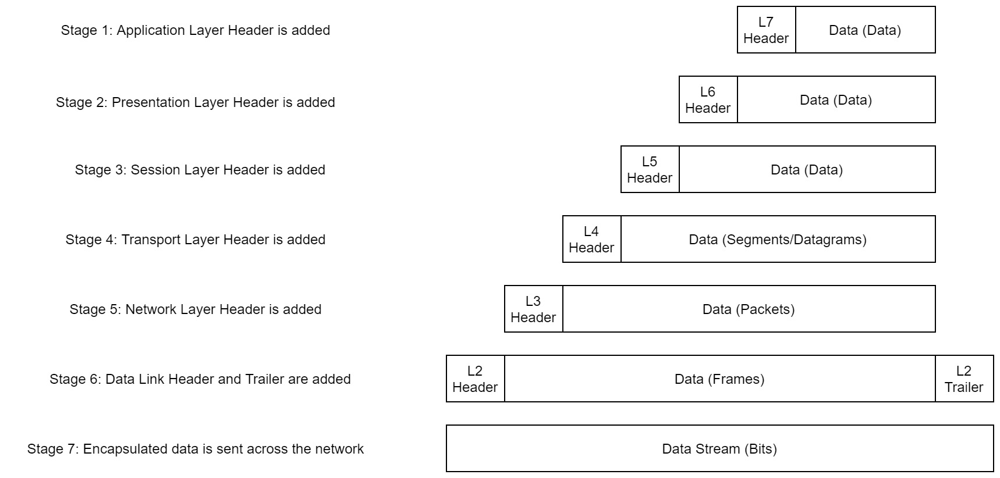
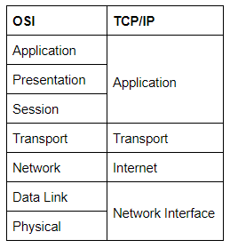
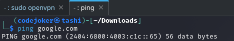
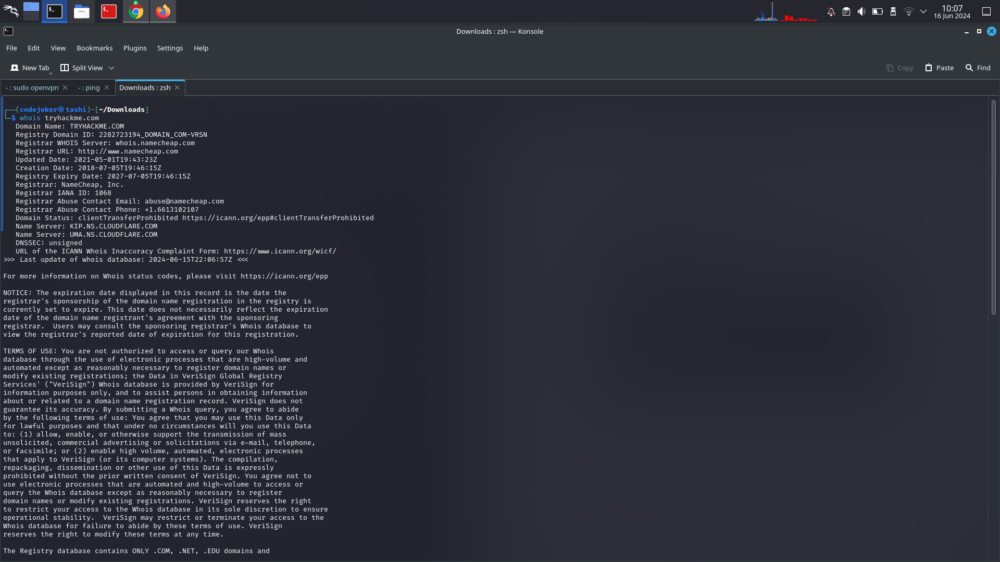
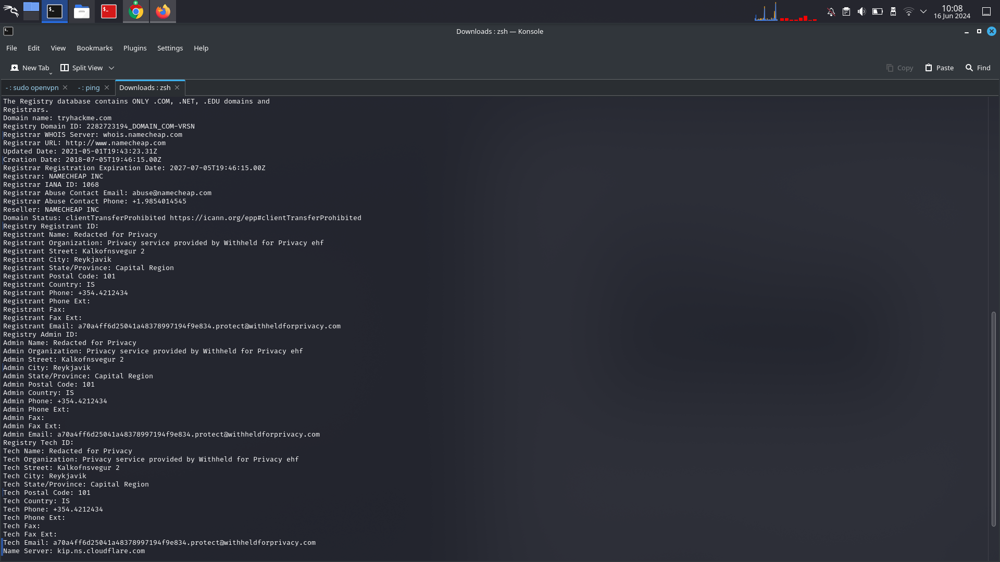

## Introductory Networking

The OSI (Open Systems Interconnection) Model is a standardised model which we use to demonstrate the theory behind computer networking. In practice, it's actually the more compact TCP/IP model that real-world networking is based off; however the OSI model, in many ways, is easier to get an initial understanding from.

There are seven layers of OSI model

Layer 7 - Application

The application layer of the OSI model essentially provides networking options to programs running on a computer. It works almost exclusively with applications, providing an interface for them to use in order to transmit data. When data is given to the application layer, it is passed down into the presentation layer.

Layer 6 - Presentation

The presentation layer receives data from the application layer. This data tends to be in a format that the application understands, but it's not necessarily in a standardised format that could be understood by the application layer in the *receiving* computer. The presentation layer translates the data into a standardised format, as well as handling any encryption, compression or other transformations to the data. With this complete, the data is passed down to the session layer.

Layer 5 - Session

When the session layer receives the correctly formatted data from the presentation layer, it looks to see if it can set up a connection with the other computer across the network. If it can't then it sends back an error and the process goes no further. If a session *can* be established then it's the job of the session layer to maintain it, as well as co-operate with the session layer of the remote computer in order to synchronise communications. The session layer is particularly important as the session that it creates is unique to the communication in question. This is what allows you to make multiple requests to different endpoints simultaneously without all the data getting mixed up (think about opening two tabs in a web browser at the same time)! When the session layer has successfully logged a connection between the host and remote computer the data is passed down to Layer 4: the transport Layer.

Layer 4 -- Transport:

The transport layer is a very interesting layer that serves numerous important functions. Its first purpose is to choose the protocol over which the data is to be transmitted. The two most common protocols in the transport layer are TCP (**T**ransmission **C**ontrol **P**rotocol) and UDP (**U**ser **D**atagram **P**rotocol); with TCP the transmission is *connection-based* which means that a connection between the computers is established and maintained for the duration of the request. This allows for a reliable transmission, as the connection can be used to ensure that the packets *all* get to the right place. A TCP connection allows the two computers to remain in constant communication to ensure that the data is sent at an acceptable speed, and that any lost data is re-sent. With UDP, the opposite is true; packets of data are essentially thrown at the receiving computer -- if it can't keep up then that's *its* problem (this is why a video transmission over something like Skype can be pixelated if the connection is bad). What this means is that TCP would usually be chosen for situations where accuracy is favoured over speed (e.g. file transfer, or loading a webpage), and UDP would be used in situations where speed is more important (e.g. video streaming).

With a protocol selected, the transport layer then divides the transmission up into bite-sized pieces (over TCP these are called *segments*, over UDP they're called *datagrams*), which makes it easier to transmit the message successfully.

Layer 3 -- Network:

The network layer is responsible for locating the destination of your request. For example, the Internet is a huge network; when you want to request information from a webpage, it's the network layer that takes the IP address for the page and figures out the best route to take. At this stage we're working with what is referred to as *Logical* addressing (i.e. IP addresses) which are still software controlled. Logical addresses are used to provide order to networks, categorising them and allowing us to properly sort them. Currently the most common form of logical addressing is the IPV4 format, which you'll likely already be familiar with (i.e 192.168.1.1 is a common address for a home router).

Layer 2 -- Data Link:

The data link layer focuses on the *physical* addressing of the transmission. It receives a packet from the network layer (that includes the IP address for the remote computer) and adds in the physical (MAC) address of the receiving endpoint. Inside every network enabled computer is a Network Interface Card (NIC) which comes with a unique MAC (Media Access Control) address to identify it.

MAC addresses are set by the manufacturer and literally burnt into the card; they can't be changed -- although they *can* be spoofed. When information is sent across a network, it's actually the physical address that is used to identify where exactly to send the information.

Additionally, it's also the job of the data link layer to present the data in a format suitable for transmission.

The data link layer also serves an important function when it receives data, as it checks the received information to make sure that it hasn't been corrupted during transmission, which could well happen when the data is transmitted by layer 1: the physical layer.

Layer 1 -- Physical:

The physical layer is right down to the hardware of the computer. This is where the electrical pulses that make up data transfer over a network are sent and received. It's the job of the physical layer to convert the binary data of the transmission into signals and transmit them across the network, as well as receiving incoming signals and converting them back into binary data.

Which layer would choose to send data over TCP or UDP? ⇒ 4

Which layer checks received information to make sure that it hasn't been corrupted? ⇒ 2

In which layer would data be formatted in preparation for transmission? ⇒ 2

Which layer transmits and receives data? ⇒ 1

Which layer encrypts, compresses, or otherwise transforms the initial data to give it a standardised format? ⇒ 6

Which layer tracks communications between the host and receiving computers? ⇒5

Which layer accepts communication requests from applications? ⇒ 7

Which layer handles logical addressing? ⇒ 3

When sending data over TCP, what would you call the "bite-sized" pieces of data? ⇒ segments

Which layer would the FTP protocol communicate with? ⇒ 7

Which transport layer protocol would be best suited to transmit a live video? ⇒ UDP

# Encapsulation

When data is passed down each layer of the model more information containing details specific to the layer in question is added on to the start of the transmission. Header added by the Network layer would include things like source and destination IP address and the header added by the Transport layer would include information specific to the protocol being used. 

The process of sending data from one computer to another computer is called ENCAPSULATION.

The encapsulated data is given a different name at different steps of the process. 

In layer 7,6 and 5 the data is referred to as data and when the data reached at transport layer the encapsulated data is referred as segments or a datagram depending on the transmission protocol. In the network layer the encapsulated data is referred to as packet. So when the packet gets passed down to the data link layer it becomes a frame and when it transmitted across a network the frame will broken down into bits. 

When the second computer receives the message the process gets reversed starting from physical layer and working up until it reaches the application layer, this process is known as de-encapsulation. The process of encapsulation and de-encapsulation is a very important because it is the standardised method for sending data. 

How would you refer to data at layer 2 of the encapsulation process (with the OSI model)? ⇒ frames

How would you refer to data at layer 4 of the encapsulation process (with the OSI model), if the UDP protocol has been selected? ⇒ Datagrams

What process would a computer perform on a received message? ⇒ de-encapsulation

Which is the only layer of the OSI model to add a *trailer* during encapsulation? ⇒ Data link

Does encapsulation provide an extra layer of security **(Aye/Nay)**? ⇒ Aye

# The TCP/IP model

The TCP/IP model consists of four layers: Application, Transport, Internet and Network Interface. Between them, these cover the same range of functions as the seven layers of the OSI Model.

The matching of OSI model and TCP/IP model.

The processes of encapsulation and de-encapsulation work in exactly the same way with the TCP/IP model as they do with the OSI model. At each layer of the TCP/IP model a header is added during encapsulation, and removed during de-encapsulation.

**T**ransmission **C**ontrol **P**rotocol controls the flow of data between two endpoints, and the **I**nternet **P**rotocol, which controls how packets are addressed and sent. 

Before sending any data via TCP, first we need to form a stable connection between the two computers. The process of forming this connection is called the *three-way handshake*.

Which model was introduced first, OSI or TCP/IP? ⇒ TCP

Which layer of the TCP/IP model covers the functionality of the Transport layer of the OSI model? ⇒transport

Which layer of the TCP/IP model covers the functionality of the Session layer of the OSI model? ⇒ application

The Network Interface layer of the TCP/IP model covers the functionality of two layers in the OSI model. These layers are Data Link, and?.. ⇒ physical

Which layer of the TCP/IP model handles the functionality of the OSI network layer? ⇒ internet 

What kind of protocol is TCP? ⇒ connection-based

What is SYN short for? ⇒ synchronise

What is the second step of the three way handshake? ⇒ SYN/ACK

What is the short name for the "Acknowledgement" segment in the three-way handshake? ⇒ ACK

# ping command

The ping command is used when we want to test whether a connection to a remote resource is possible. It works using the ICMP protocol, which is one of the slightly less well-known TCP/IP protocols that were mentioned earlier. The ICMP protocol works on the Network layer of the OSI Model, and thus the Internet layer of the TCP/IP model. 

Notice that the ping command actually returned the IP address for the Google server that it connected to, rather than the URL that was requested.

What command would you use to ping the bbc.co.uk website? ⇒ ping bbc.co.uk

Ping muirlandoracle.co.uk. What is the IPv4 address? ⇒ 217.160.0.152

What switch lets you change the interval of sent ping requests? ⇒ -i

What switch would allow you to restrict requests to IPv4? ⇒ -4

What switch would give you a more verbose output? ⇒ -v

# Traceroute

The internet is combination of different servers and endpoints that networked up to each other. So to get the content first it need to go through a bunch of other severs but the traceroute allows us to see each of these connections that allows us to see every intermediate step between our computer and the resource that we request. The basic syntax for traceroute on the Linux is traceroute destination

<!-- ! [alt text](../assets/trace.png) -->

What switch would you use to specify an interface when using Traceroute?⇒> -i

What switch would you use if you wanted to use TCP SYN requests when tracing the route? ⇒ -T

Which layer of the ***TCP/IP*** model will traceroute run on by default (Windows)? ⇒ internet

# WHOIS

It is hard to remember ever IP address of a website we want to visit. So to make it easier we have got domains.

Domains are leased out by companies called Domain Registrars. If you want a domain, you go and register with a registrar, then lease the domain for a certain length of time. 

WHOIS essentially allows us to query who the domain name is registered. 

Whois lookups are very easy to perform. Just use whois domain to get a list of available information about the domain registration:

