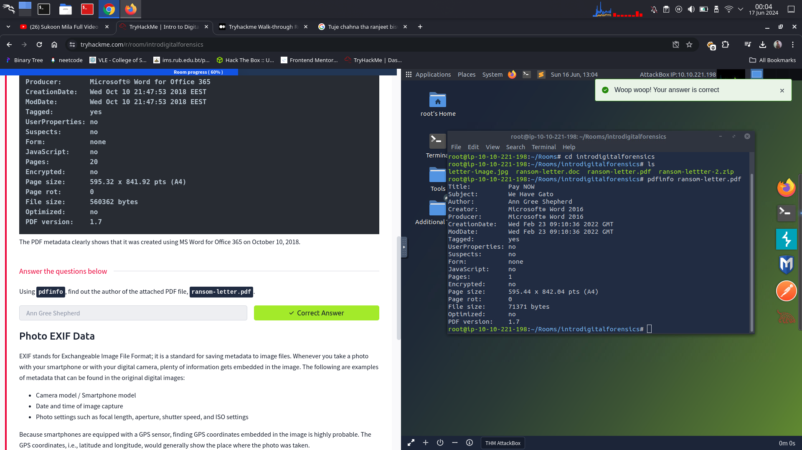
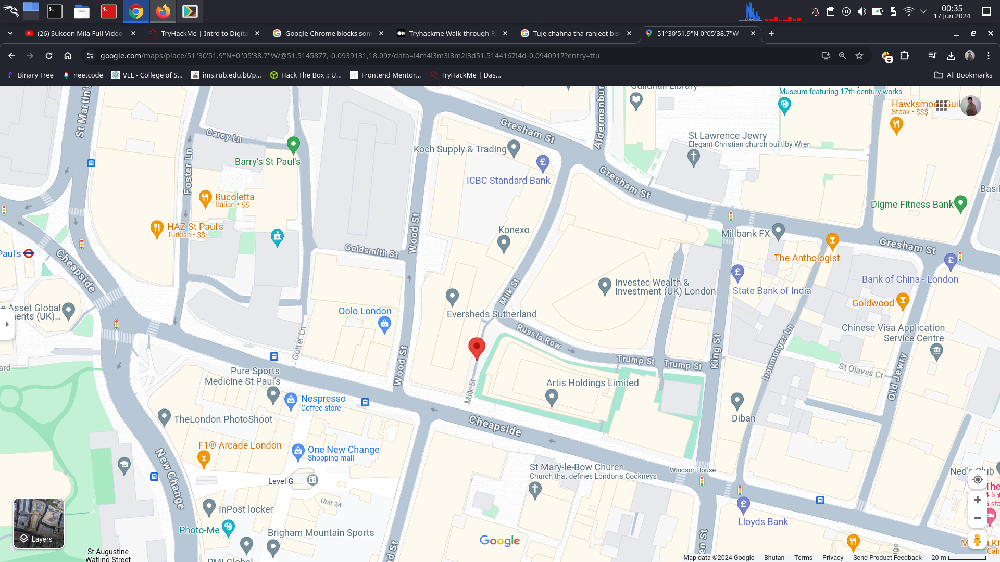

## Introduction to digital forensics

Forensic is the application of science to investigate crimes and establish facts. Example if the law enforcement agents arrive at a crime scene and however part of the crime scene includes digital devices and media. So the digital devices include laptops, mobile, digital cameras and so forth. 

More formally, digital forensics is the application of computer science to investigate digital evidence for a legal purpose. Digital forensics is used in two types of investigations:

1. **Public-sector investigations** refer to the investigations carried out by government and law enforcement agencies. They would be part of a crime or civil investigation.

2. **Private-sector investigations** refer to the investigations carried out by corporate bodies by assigning a private investigator, whether in-house or outsourced. They are triggered by corporate policy violations.

Consider the desk in the photo above. In addition to the smartphone, camera, and SD cards, what would be interesting for digital forensics? ⇒ Laptop

Following are some of the things that a authorized digital forensics investigator should do, 

1. Acquire the evidence : collecting the digital devices such as laptops, mobile and so forth. 

2. Establish a chain of custody: Filling out the related form to ensure that only the authorized investigator have the right to access the evidence.

3. Place the evidence in a secure container: the investigator should ensure that the evidence does not get damage. 

4. The evidence should transport to the lab safely. 

When the evidence is placed at lab, the following process should be followed,

1. The digital evidence should be retrieve form the secure container.

2. Create a forensic copy of the evidence to avoid modifying the original data.

3. Secure the digital evidence and work on the copy and if the copy is damage we can always create a new copy. 

4. Star processing the copy.

It is essential to keep track of who is handling it at any point in time to ensure that evidence is admissible in the court of law. What is the name of the documentation that would help establish that? ⇒ chain of custody

# Document metadata 

When we create a text file, some of the metadata gets saved in the operating system such as file creation date and modification date. There are various ways to read the file meta data. 

**`pdfinfo`**. is one tool to read the metadata of the file. 

Using **`pdfinfo`**, find out the author of the attached PDF file, **`ransom-letter.pdf`**. ⇒ Ann Gree Shepherd

# Photo EXIF data 

EXIF stands for Exchangeable Image File Format is a standard for saving metadata to image files when ever we take photo with our smart phone or with the digital camera. Moreover since our smart phone is equipped with a GPS sensor, the coordinates that is latitude and longitude will also be shown. 

Using **`exiftool`** or any similar tool, try to find where the kidnappers took the image they attached to their document. What is the name of the street? ⇒ Milk Street

What is the model name of the camera used to take this photo? ⇒ Canon EOS R6

