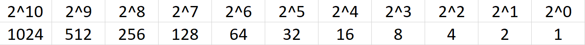
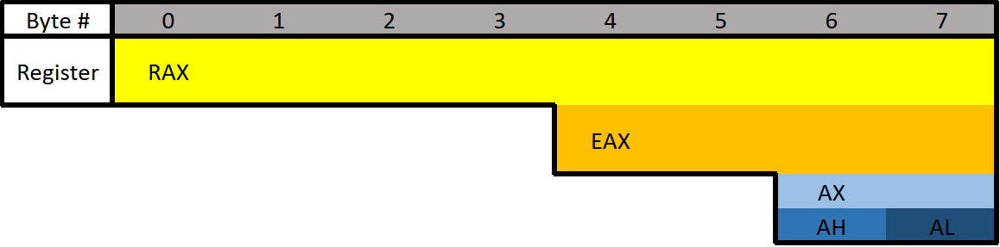

## Windows x64 Assembly

Reverse engineering is a process in which software are deconstructed to extract design information from them.

Number system

Base 10 : humans use the decimal( base 10) system.

Base 10 includes 0 till 9. If we write 243 in base 10 it would be as follows

243 = (10^2* 2) + (10^1* 4) + (10^0 * 3) = 200 + 40 + 3.

Base 7 : base 7 includes 0 till 6. if we write 243 in base 7 it would be as follows

243 = (7^2 * 2) + (7^1 * 4) + (7^0 * 3) = 98 + 28 + 3 = 129(in decimal).

9 = (7^1 * **1**) + (7^0 * **2**) = 7 + 2. Our answer is going to be 12(base7) = 9(base10).

Base 2 : it includes 0 and 1. Some of the good values to know are as follows

<!--  -->

Binary are usually denoted with the prefix "0b" such as 0b0110 and sometimes denoted with the suffix "b" such as 110b.

# Hexadecimal 

Hexadecimal is base 16 (hexa = 6, dec = 10). we use letters such as A,B,C,D,E and F for the number that is above 9. Hexadecimal numbers are usually given a “0x” prefix or the suffix “h” such as 0xFF or FFh. 

0x4A = (161 * 4d) + (160 * 10d) = 64d + 10d = 74d.

What is 0xA in decimal? ⇒ 10

What is decimal 25 in hexadecimal? Include the prefix for hexadecimal. ⇒ 0x19

Bits and bytes

Some of the common types of data size based on architecture are’;

1. Bits in one binary digit that can be 0 or 1.

2. Nibble is 4 bits.

3. Byte is 8 bits.

4. Word is 2 bytes

5. Double word (DWORD) is 4 bytes. which is twice the size of word.

6.  Quad word (QWORD) is 8 bytes. which is four times the size of a word.

There is also another type of data type that is singed and unsigned. Signed numbers can be positive or negative but unsigned number can be only positive. 

# Data type sizes

1. Char - 1 byte( 8 bits)

2. Int - there are 16-bit, 32-bit, and 64-bit integer. but when talking about integers it is usually 32-bit. 

3. Bool - 1 byte. 

How many bytes is a WORD? ⇒ 2

How many bits is a WORD? ⇒ 16

# Binary Operations 

In computing FALSE is represented with the value 0 and TRUE is represented as anything other that 0. 

NOT(”!”) = NOT 1= 0 / NOT 0 = 1

AND(”&”) = 1 AND 1 = 1/ 1 AND 0 = 0/ 0 AND 0 = 0.

OR (”|”) = 1 OR 1 = 1/ 1 OR 0 = 1/ 0 OR 0 = 0.

XOR(”^”) = 1 XOR 1 = 0/ 1 XOR 0 = 1/ 0 XOR 0 = 0.

What is the result of the binary operation: 1011 AND 1100? ⇒ 1000

What is the result of the binary operation: 1011 NAND 1100? *Include* leading zeroes? ⇒ 0111

# Registers 

There are two different syntaxes for assembly that is intel and AT&T. 

The conversion of high level code into the a language that the CPU 

can understand is called Assembly. 

The CUP has its won storage that is extremely fast and greater. But space is in the CUP is extremely limited. So the data that is too big to fit in a register is stored in memory(RAM). However accessing memory is much slower for the CPU compared to accessing a register because of the slow speed. That’s why CPU tries to put all the data in registers instead of memory. 

There are 8 main general purpose of registers:

- RAX - Known as the **accumulator register**. Often used to store the return value of a function.

- RBX - Sometimes known as the **base register**, not to be confused with the base pointer. Sometimes used as a base pointer for memory access.

- RDX - Sometimes known as the **data register**.

- RCX - Sometimes known as the **counter register**. Used as a loop counter.

- RSI - Known as the **source index**. Used as the source pointer in string operations.

- RDI - Known as the **destination index**. Used as the destination pointer in string operations.

- RSP - The **stack pointer**. Holds the address of the top of the stack.

- RBP - The **base pointer**. Holds the address of the base (bottom) of the stack.

Each register can be broken down into segments which can be referenced with other register names. RAX is 64 bits, the lower 32 bits can be referenced with EAX, and the lower 16 bits can be referenced with AX. AX is broken down into two 8 bit portions. The high/upper 8 bits of AX can be referenced with AH. The lower 8 bits can be referenced with AL.

<!--  -->

RAX consists of all 8 bytes which would be bytes 0-7. EAX consists of bytes 4-7, AX consists of bytes 6-7, AH consists of only byte 6, and AL consists of only byte 7 (the final byte).

What is the difference between the "E" and "R" prefixes? Besides one being a 64-bit register and the other 32 bits, the **"E" stands for extended**. The **"R" stands for register**.

# Different data types

- **Floating Point Values** - Floats and Doubles.

- **Integer Values** - Integers, Booleans, Chars, Pointers, etc.

Floating-point values are represented differently than integers. Because of this, floating-point values have special registers. These registers include YMM0 to YMM15(64-bit) and XMM0 to XMM15 (32-bit). The XMM registers are the lower half of the YMM registers, similar to how EAX is the lower 32 bits of RAX.

Extra registers

There are additional registers that should be mentioned. These registers don't have any special uses.

How many bytes is RAX? ⇒ 8

How many bytes is EAX? ⇒ 4

Instructions

There are 1500 instructions and a majority of the instructions are not commonly used or they are just variations. There are three different terms that we should know: immediate, register and memory.

- An immediate value (or just immediate, sometimes IM) is something like the number 12. An immediate value is *not* a memory address or register, instead, it's some sort of constant data.
- A register is referring to something like RAX, RBX, R12, AL, etc.
- Memory or a memory address refers to a location in memory (a memory address) such as 0x7FFF842B.

The semicolon at the end of or in between of a few assembly instructions is to write a comment in assembly.

Common Instructions

Data movement

**MOV** is used to move/store the source operand into the destination. The source doesn't have to be an immediate value like it is in the following example. In the following example, the immediate value of 5 is being moved into RAX.

mov RAX, 5  

LEA is short for Load Effective Address. This is essentially the same as MOV except for addresses. The key difference between MOV and LEA is that LEA doesn't dereference. It's also commonly used to compute addresses.

lea RAX, num1
;RAX is set to the address of num1.
lea RAX, [struct+8]
;RAX is set to the address of the member in a structure-
;which is 8 bytes from the start of the structure. 
mov RBX, 5
;RBX is set to 5, then LEA is used to set RAX to RBX + 1. 
lea RAX, [RBX+1]
;RAX will be 6.

PUSH is used to push data onto the stack or it refers to pushing something on the top of the stack.

push RAX
;RAX is pushed onto the stack. pushing will act as a copy so RAX-
;will still contain the value it had before it was pushed.

POP is used to take whatever is on the top of the stack and store it in the destination. 

pop RAX
;What ever is on the top of the stack will be put into RAX

INC will increment data by one. 
mov RAX, 8
inc RAX
;RAX is set to 8 and then incremented by one. Now the RAX will be 9 by the end.

DEC will decrement data by one.
mov RAX, 8
dec RAX
;RAX is set to 8 and then decrement by one. Now the RAX will be 7 by the end.

ADD will add a source to a destination and stores the result in the destination. 
mov RAX, 2
mov RBX, 3
add RAX, RBX
; 2 is moved to RAX, 3 is moved into RBX and it is added together resulting into 5

SUB will subtracts a source from a destination and stores the result in the destination.
mov RAX, 5
mov RBX, 3
sub RAX, RBX
;5 is moved to RAX, 3 is moved to RBX and it is subtracted resulting into 2

Multiplication and division. 

MUL( unsigned )/IMUL ( signed). It is bit different because data can be vary and changed greatly when multiplying and dividing, they use a concatenation of two registers to store the result. The upper half of the result is stored in RDX and the lower half is in RAX. So the total result of the operation is RDX:RAX.

mov RAX, 25
mov RBX, 5
mul RBX ; here RAX 25 is multiplied with RBX 5 resulting to 125

DIV (unsigned) / IDIV (signed). What we divide is stored in RAX and what we want to divide it by is passed at the operand. Finally the result is stored in RDX:RAX.

mov RAX, 18
mov RBX, 3
div RBX ; Divides RAX (18) by RBX (3) resulting to 6