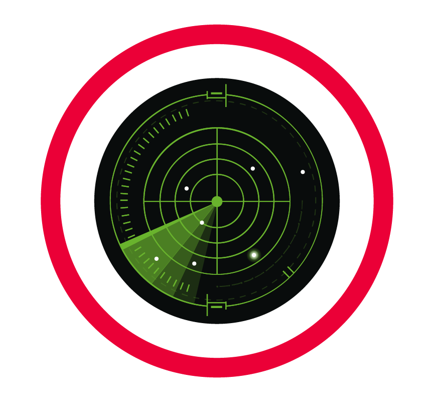
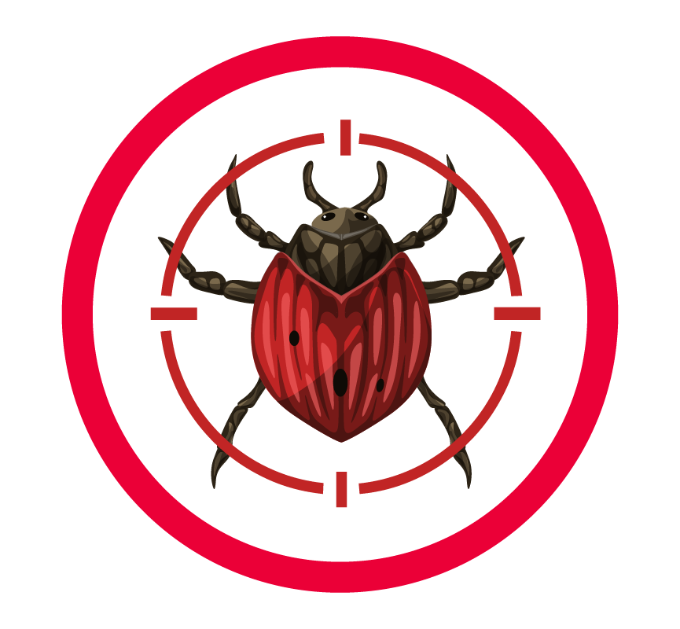
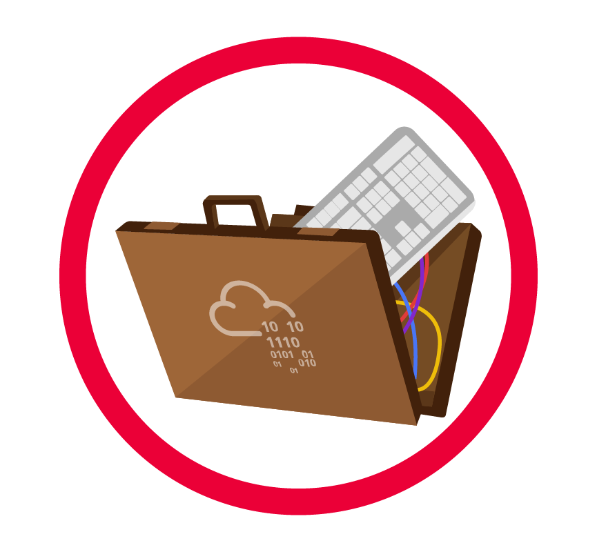
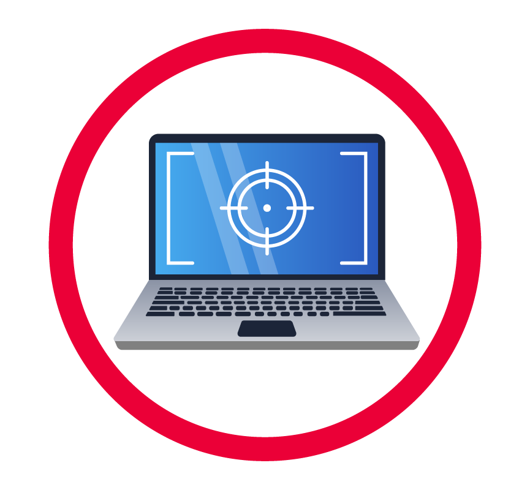
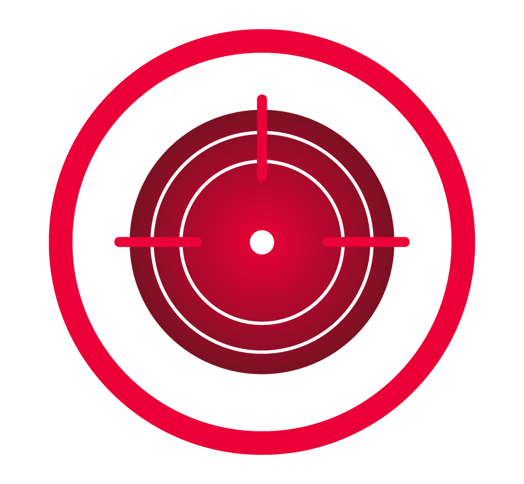

## Cyber kill chain.

The cyber kill chain framework is designed for identification and prevention of the network intrusions.

The kill chain is a military concept related to the structure of an attack. it consist of target identification,  decision and order to attack the target and finally the target destruction.

Why it is important to understand how cyber kill chain work?

It is important to understand the cyber kill chain because we can understand and protect against ransomware attacks, security breaches and advance persistent threats (ATPs). We can use the cyber kill chain to assess our network and system security by identifying missing security controls and closing certain security gaps based on our company’s infrastructure.

- ransomware attack : a type of malware that locks and encrypts a victim’s data, files, device or systems, rendering them inaccessible and unusable until the attacker receives a ransom payment.

# Reconnaissance

Discovering and collecting information on the system and the victim and it is the planning phase for the adversaries. 

OSINT( open-source Intelligence ) is also a reconnaissance. Here the attacker needs to collect every available piece of information on the company and it’s employees. 

email harvesting is the process of obtaining email addresses from public, paid or free service. It is used for phishing attack where the attacker steal the sensitive data including login credentials and other important data. 

The tool use in the email harvester are:

1. theHarvester : use in gathering emails, names, subdomains, IPs, and URL using multiple public data source. 
2. [Hunter.io](http://Hunter.io) : tool that will obtain contact information associate with the domain. 
3. OSINT Framework : collection of OSINT tools based on various categories. 

What is the name of the Intel Gathering Tool that is a web-based interface to the common tools and resources for open-source intelligence? ⇒ OSINT Framework

What is the definition for the email gathering process during the stage of reconnaissance? ⇒ email harvesting

# Weaponization

Most attackers usually use automated tools to generate the malware or refer the DarkWeb to purchase the malware. 

**Malware :** is a program or software that is designed to damage, disrupt or gain unauthorized access to a computer. 

**Exploit :** is a program or a code that takes advantage of the vulnerability or flaw in the application or system. 

**Payload :** is a malicious code that the attacker runs on the system. 

In the Weaponization phase the attacker would :

- Create an infected mircosoft office document containing a malicious macro or VBA  (visual basic for applications) script.
- An attacker can create a malicious playload or a very sophisticated worm, implant it on the USB drives and then distribute them in public.
- An attacker would choose command and control (C2) techniques for executing the commands on the victim’s machine or deliver more payloads.
- An attacker would select a backdoor implant the way to access the computer system,  which includes bypassing the security mechanisms.

This term is referred to as a group of commands that perform a specific task. You can think of them as subroutines or functions that contain the code that most users use to automate routine tasks. But malicious actors tend to use them for malicious purposes and include them in Microsoft Office documents. Can you provide the term for it? ⇒ Macro

# Delivery

The delivery phase is choosing the method for transmitting the payload or the malware. 

some of the ways are listed below ; 

1. Phishing email : the attacker would craft a malicious email that contains a payload that would target either a specific person or multiple people in the company. 
2. Distributing infected USB drives in public place or conducting a sophisticated USB drop attack by printing the company’s logo on the USB drives and mailing them to the company while pretending to be a customer sending the USB devices as a gift. 
3. Watering hole attack is a targeted attack designed to aim at a specific group of people by compromising the website of an attacker’s choice. 

What is the name of the attack when it is performed against a specific group of people, and the attacker seeks to infect the website that the mentioned group of people is constantly visiting. ⇒ Watering hole attack

# Exploitation

In this phase the attacker needs to exploit the vulnerability to gain access to the system.  After gaining access to the system, the attacker will exploit the software, system and server-based vulnerability to escalate or move laterally through the network. 

lateral movement is the techniques that the attacker use after gaining initial access to the victim’s machine to move deeper in to a network to obtain sensitive data. 

These are examples of how an attacker carries out exploitation:

- The victim triggers the exploit by opening the email attachment or clicking on a malicious link.
- Using a zero-day exploit.
- Exploit software, hardware, or even human vulnerabilities.
- An attacker triggers the exploit for server-based vulnerabilities

Can you provide the name for a cyberattack targeting a software vulnerability that is unknown to the antivirus or software vendors? ⇒ Zero-day

# Installation

Attacker needs to install a persistent backdoor to reaccess the system if the attacker has lose the connection to the target or got detected and got the initial access removed. The persistent backdoor will let the attacker access the system that is compromised in the past. 

The persistence can be achieved through:

- Installing a **web shell** on the webserver. A web shell is a malicious script written in web development programming languages such as ASP, PHP, or JSP used by an attacker to maintain access to the compromised system. Because of the web shell simplicity and file formatting (.php, .asp, .aspx, .jsp, etc.) can be difficult to detect and might be classified as benign
- Installing a backdoor on the victim's machine. For example, the attacker can use [Meterpreter](https://www.offensive-security.com/metasploit-unleashed/meterpreter-backdoor/) to install a backdoor on the victim's machine. Meterpreter is a Metasploit Framework payload that gives an interactive shell from which an attacker can interact with the victim's machine remotely and execute the malicious code.
- Creating or modifying Windows services. ****This technique is known as [T1543.003](https://attack.mitre.org/techniques/T1543/003/) on MITRE ATT&CK (MITRE ATT&CK® is a knowledge base of adversary tactics and techniques based on real-world scenarios). An attacker can create or modify the Windows services to execute the malicious scripts or payloads regularly as a part of the persistence. An attacker can use the tools like **sc.exe** (sc.exe lets you Create, Start, Stop, Query, or Delete any Windows Service) and [Reg](https://attack.mitre.org/software/S0075/) to modify service configurations. The attacker can also [**masquerade**](https://attack.mitre.org/techniques/T1036/) the malicious payload by using a service name that is known to be related to the Operating System or legitimate software.
- Adding the entry to the "run keys" for the malicious payload in the Registry or the Startup Folder. By doing that, the payload will execute each time the user logs in on the computer. According to MITRE ATT&CK, there is a startup folder location for individual user accounts and a system-wide startup folder that will be checked no matter what user account logs in.

The attacker can also use the Timestomping technique to avoid detection by the forensic investigation and also to make the malware appear as a part of a legitimate problem. 

Can you provide the technique used to modify file time attributes to hide new or changes to existing files? = > Timestomping

Can you name the malicious script planted by an attacker on the webserver to maintain access to the compromised system and enables the webserver to be accessed remotely? ⇒ web shell

# Command and Control

C2 ( Command and Control ) can remotely control and manipulate the victim. This term is also known as C&C or C2 Beaconing as a type of malicious communication between a C&C server and malware on the infected host. 

The compromised endpoint would communicate with an external server set up by an attacker to establish a command & control channel. After establishing the connection,  the attacker has full control of the victim's machine. Until recently, IRC (Internet Relay Chat) was the traditional C2 channel used by attackers. This is no longer the case, as modern security solutions can easily detect malicious IRC traffic.

The most common C2 channels used by adversaries nowadays:

- The protocols HTTP on port 80 and HTTPS on port 443 - this type of beaconing blends the malicious traffic with the legitimate traffic and can help the attacker evade firewalls.
- DNS (Domain Name Server). The infected machine makes constant DNS requests to the DNS server that belongs to an attacker, this type of C2 communication is also known as DNS Tunneling.

Important to note that an adversary or another compromised host can be the owner of the C2 infrastructure.

What is the C2 communication where the victim makes regular DNS requests to a DNS server and domain which belong to an attacker. ⇒ DNS Tunneling

# Actions on Objectives (Exfiltration)

With hands-on keyboard access, the attacker can achieve the following:

- Collect the credentials from users.
- Perform privilege escalation (gaining elevated access like domain administrator access from a workstation by exploiting the misconfiguration).
- Internal reconnaissance (for example, an attacker gets to interact with internal software to find its vulnerabilities).
- Lateral movement through the company's environment.
- Collect and exfiltrate sensitive data.
- Deleting the backups and shadow copies. Shadow Copy is a Microsoft technology that can create backup copies, snapshots of computer files, or volumes.
- Overwrite or corrupt data.

Can you provide a technology included in Microsoft Windows that can create backup copies or snapshots of files or volumes on the computer, even when they are in use?  ⇒ shadow copy