## Metasploit : Introduction

Metasploit is the most widely used exploitation framework and it is the powerful tool that can support all phases of penetration testing engagement from information gathering to post-exploitation. 

The Metasploit framework is a set of tools that allow information gathering, scanning, exploitation, exploit development, post-exploitation and more. 

The primary usage of Metasploit framework is to focus on the penetration testing domain and vulnerability research and exploit development. 

The main components of the Metasploit framework can be summarized as follows ;

- msfconsole : the main command line interface.
- Modules : supporting modules  such as exploit, scanners, payloads, etc.
- Tools : stand-alone tools that will help vulnerability research, vulnerability assessment, or penetration testing. Some of these tools are msfvenom, pattern_create and pattern_offset

# **Main components of metasploit**

The msfconsole is the main interface to interact with the different modules of the Metasploit Framework. 

There are small components within the Metasploit framework that are built to perform a specific task, such as exploiting a vulnerability, scanning a target, or performing a brute-force attack. 

few recurring concepts :

1. **exploit** : a piece of code that uses a vulnerability on the target system. 
2. **Vulnerability** : a design, coding, or logical flaw affecting the target system. 
3. **Payload** : the code that will run on the target system.

Modules and categories under each one are listed below.

1. **Auxiliary** 

Any supporting module, such as scanners, crawlers and fuzzers, can be found here.

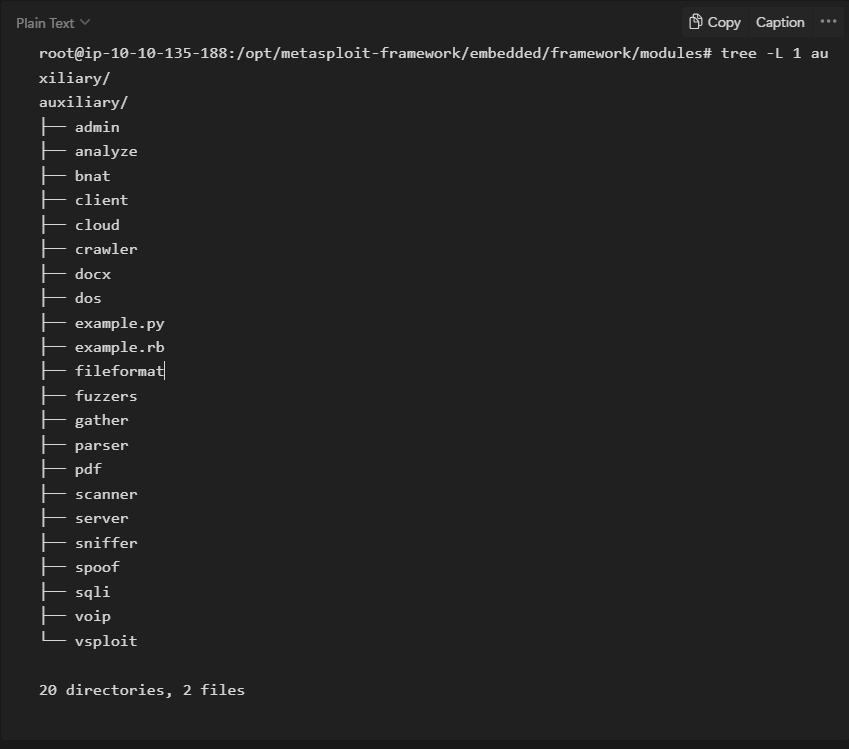

2. **Encoders**

Encoders will allow us to encode the exploit and payload in the hope that a signature-based antivirus solution may miss them.

Signature-based antivirus and security solutions have a database of known threats. They detect threats by comparing suspicious files to this database and raise an alert if there is a match. Thus encoders can have a limited success rate as antivirus solutions can perform additional checks.

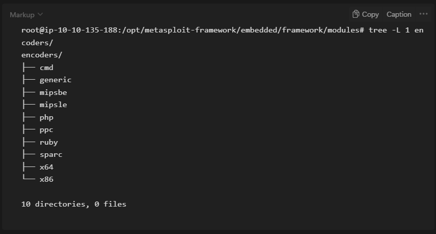

3. **Evasion** 

While encoders will encode the payload, they should not be considered a direct attempt to evade antivirus software. On the other hand, “evasion” modules will try that, with more or less success.

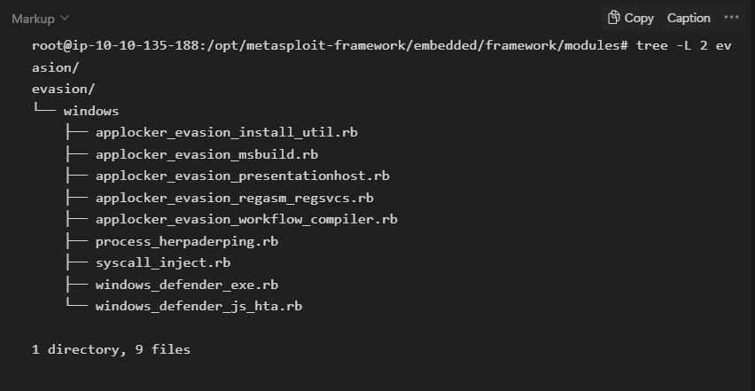

4. Exploits

Exploits, neatly organized by target system.

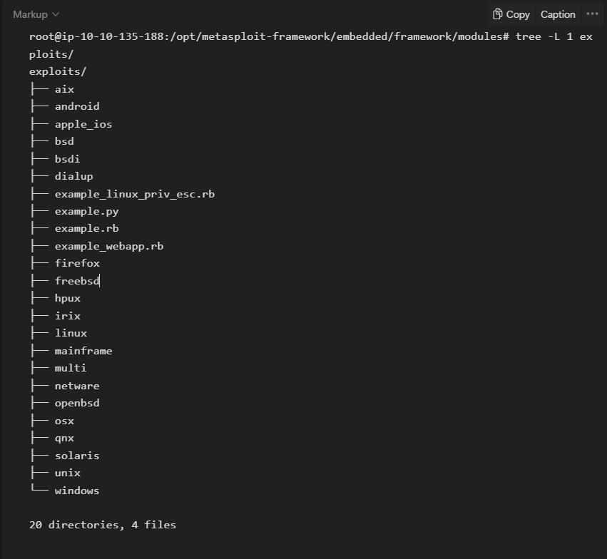

5. **NOPs**

NOPs (No OPeration) do nothing, literally. They are represented in the Intel x86 CPU family with 0x90, following which the CPU will do nothing for one cycle. They are often used as a buffer to achieve consistent payload sizes.

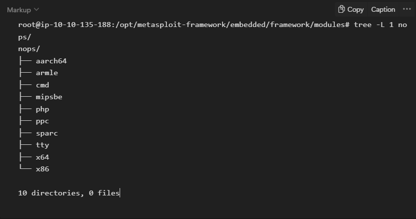

6. **Payloads**

Payloads are codes that will run on the target system.

Exploits will leverage a vulnerability on the target system, but to achieve the desired result, we will need a payload.

Running command on the target system is already an important step but having an interactive connection that allows you to type commands that will be executed on the target system is better. 

Such an interactive command line is called a "shell". Metasploit offers the ability to send different payloads that can open shells on the target system.

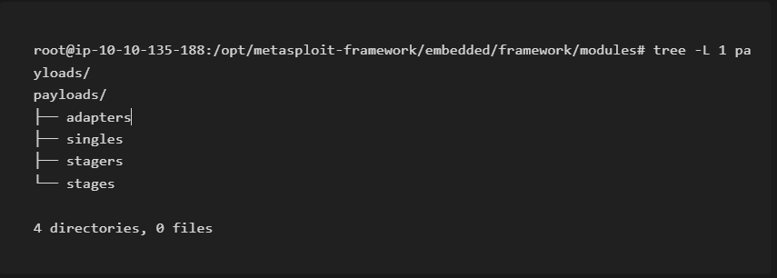

four different directories under payloads: adapters, singles, stagers and stages.

- **Adapters:** An adapter wraps single payloads to convert them into different formats. For example, a normal single payload can be wrapped inside a Powershell adapter, which will make a single powershell command that will execute the payload.
- **Singles:** Self-contained payloads (add user, launch notepad.exe, etc.) that do not need to download an additional component to run.
- **Stagers:** Responsible for setting up a connection channel between Metasploit and the target system. Useful when working with staged payloads. “Staged payloads” will first upload a stager on the target system then download the rest of the payload (stage). This provides some advantages as the initial size of the payload will be relatively small compared to the full payload sent at once.
- **Stages:** Downloaded by the stager. This will allow you to use larger sized payloads.

Metasploit has a subtle way to help you identify single (also called “inline”) payloads and staged payloads.

- generic/shell_reverse_tcp
- windows/x64/shell/reverse_tcp

Both are reverse Windows shells. The former is an inline (or single) payload, as indicated by the “_” between “shell” and “reverse”. While the latter is a staged payload, as indicated by the “/” between “shell” and “reverse”.

7. **Post**

Post modules will be useful on the final stage of the penetration testing process listed above, post-exploitation.

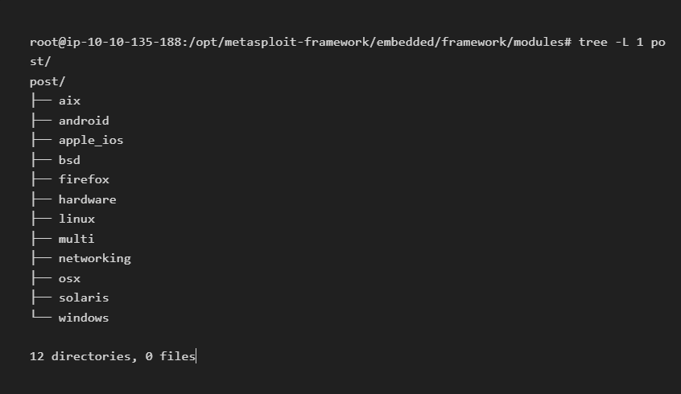

What is the name of the code taking advantage of a flaw on the target system? ⇒ exploit

What is the name of the code that runs on the target system to achieve the attacker's goal? ⇒ payload

What are self-contained payloads called? ⇒ singles

Is "windows/x64/pingback_reverse_tcp" among singles or staged payload? ⇒ singles


# **msfconsole**

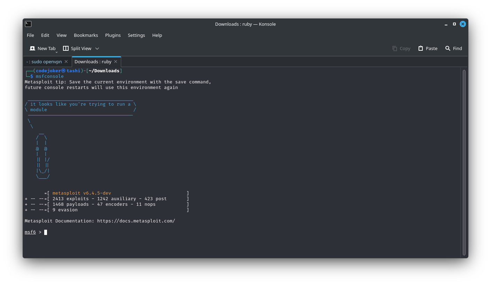

The Matasploit console can be just like a regular command line shell. the first command is “ls” which lists the contents of the folder from which Metasploit was launched using the “msfconsole” command. Followed by a “ping” sent to Google’s DNS IP address(8.8.8.8). The command is added with “-c 1” option to only sent a single ping. it also support the most Linux commands. 

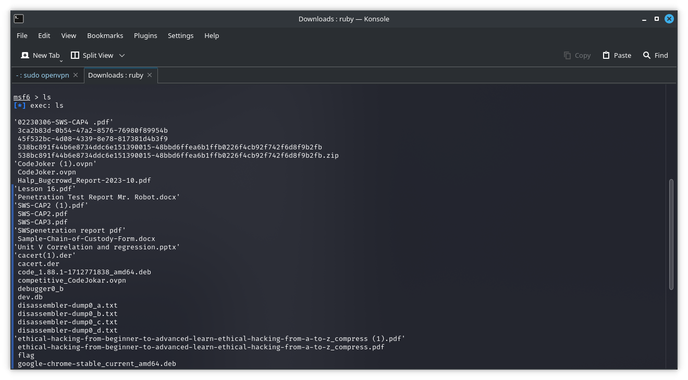

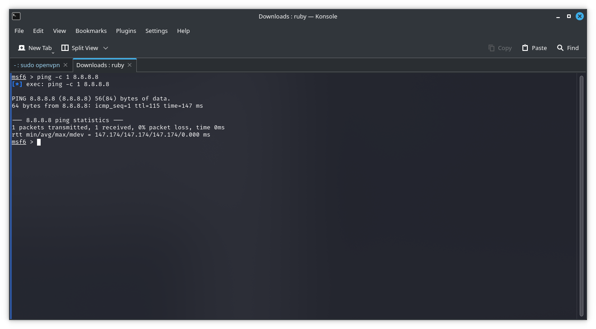

Another essential piece of information returned is in the “rank” column. Exploits are rated based on their reliability. The table below provides their respective descriptions.

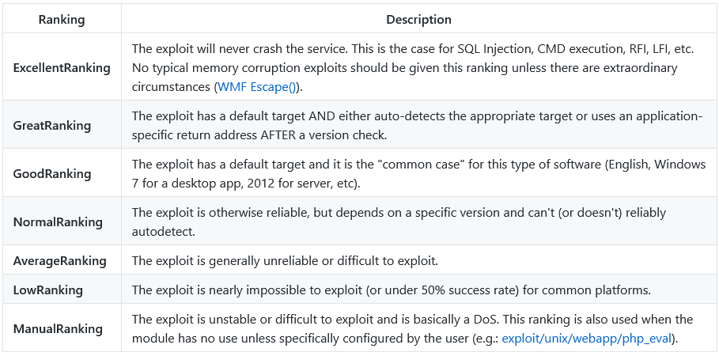

How would you search for a module related to Apache? ⇒ search apache

Who provided the auxiliary/scanner/ssh/ssh_login module? ⇒ todb

# Working with modules

All the parameter are set using the same command syntax using : 

```set PARAMETER_NAME VALUE```

Metasploit have five different prompts:

- The regular command prompt : cannot use metasploit commands here

```root@ip-10-10-XX-XX:~#```

- The msfconsole prompt : msf6 is the msfconsole prompt. Here there is no context is set, no context-specific commands to set parameters and run modules and run modules can not be used here.

```msf6 >```

A context prompt : once if we have decided to use a module and use the set command to choose it, the msfconsole will show the context. we can use the specific commands.

```set RHOSTS 127.0.0.1```

The Meterpreter prompt : it is an important payload that we will see in detail. it was loaded to the target system and connected back to the host system.

```meterpreter >```

A shell on the target system :  Once the exploit is completed, we may access to a command shell on the target system. This is a regular command line and all the commands typed here will run on the target system.

```C:\Windows\system32>```

the show options command will list all the available parameters

````msf6 exploit(windows/smb/ms17_010_eternalblue) > show options```

Module options (exploit/windows/smb/ms17_010_eternalblue):

   Name           Current Setting  Required  Description
   ----           ---------------  --------  -----------
   RHOSTS                          yes       The target host(s), range CIDR identifier, or hosts file with syntax 'file:'
   RPORT          445              yes       The target port (TCP)
   SMBDomain      .                no        (Optional) The Windows domain to use for authentication
   SMBPass                         no        (Optional) The password for the specified username
   SMBUser                         no        (Optional) The username to authenticate as
   VERIFY_ARCH    true             yes       Check if remote architecture matches exploit Target.
   VERIFY_TARGET  true             yes       Check if remote OS matches exploit Target.


Payload options (windows/x64/meterpreter/reverse_tcp):

   Name      Current Setting  Required  Description
   ----      ---------------  --------  -----------
   EXITFUNC  thread           yes       Exit technique (Accepted: '', seh, thread, process, none)
   LHOST     10.10.44.70      yes       The listen address (an interface may be specified)
   LPORT     4444             yes       The listen port


Exploit target:

   Id  Name
   --  ----
   0   Windows 7 and Server 2008 R2 (x64) All Service Packs


```msf6 exploit(windows/smb/ms17_010_eternalblue) >```

Parameters that we will often use are:

- **RHOSTS :** “Remote host” , the IP address of the target system. Here a single IP address or a network range can be set. This will support the CIDR ( classless Inter-Domain Routing) notation or a network range.
- **RPORT : “**Remote port”, the port on the target system where the vulnerable application is running on.
- **PAYLOAD :** The payload that we use with the exploit.
- **LHOST : “**Localhost”. the attacking machine IP address.
- **LPORT :** “Local Port”, the port we use for the reverse shell to connect.
- **SESSION :** Each connection established to the target system using Metasploit will have a session ID that will connect to the target system using an existing connection.

How would you set the LPORT value to 6666? ⇒ set LPORT 6666

How would you set the global value for RHOSTS  to 10.10.19.23 ? ⇒ setg RHOSTS 10.10.19.23

What command would you use to clear a set payload? ⇒ unset PAYLOAD

What command do you use to proceed with the exploitation phase? ⇒ exploit